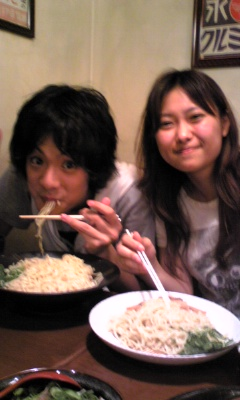

稽古帰りにラーメンを食べに行ってきました。

Let's飯ニケーション☆☆

写真は、二回生のパワーある二人。

岡崎正典メンバー(左)

西川真由美メンバー(右)

よい食べっぷり♪

by演出

## 夜も遅くにこんばんは☆

初投稿ですっ！濱津ですっ！

もう七月になってしまいましたね。

最近暑すぎで、ちょっと動いただけで汗だくです。

さてさて、この夏は「成長する夏」ということで日々稽古に励んでおります！！

まずはテンション上げ↑＆維持です！

上げたテンションを保つのってけっこう大変なんです。

大きな声を出して勢いつけて基礎練に取り組んで訓練中です！！

なので最近は高槻キャンパスに我らの咆哮がこだましてます（笑）

今月から土曜も稽古です！！

あいにく私は参加できないのですが・・・（泣）

てことで、今日もみんなで頑張りましょう！！

## 本日は晴天なり

最近、蒸し暑い日が続いていますね。

皆さまはいかがお過ごしでしょうか？

どうも、こんにちは！

写真で度々登場している、2回生の西川真由美ですm(\_\_)m

それにしても、ホントに暑いですね！

最近はランニングが日課の真由美ですが、この暑さでいつも汗びっしょりです。

今日も稽古の前に走ろうと、2回生メンバーの岡崎正典と約束しました

が！

約束の時間に30分遅刻中ですorz

今、高槻キャンパスに行くバスに揺られながらブログを書かせて頂いてます。

窓から見る空は晴れてて綺麗です

話を戻して…

走っててしんどくなるとよく空を見ます

青くて真っ白な雲を見ると何だか癒されて

「まだまだ走れる！」と思えます。

そして、隣に仲間がいたら文句なし！

たぶん、一人では続かなかったランニングも仲間がいて楽しく走っています

本日は晴天なり

気持ちよく走れそうです

蒸し暑いですが(笑)

さて、そろそろ学校に着きます！

今日も稽古頑張りますよ！
