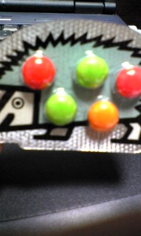

真夜中にこんばんは。2回生メンバーの西川真由美です。

皆さま、ご存じでしたか？

天気予報によると7月5日は猛暑だったらしいです

そんなの知るか！

と言わんばかりに高槻キャンパスから神社まで2回生メンバーの岡崎正典と走って参りました

ちなみに、2回生メンバーの住野なつきは萩谷公園まで走ってました！

いい傾向ですね～(\*´艸\`)

なーんて思いながら、私は初の神社へ向かったんですが

日射しも強くて

予想以上に息があがって神社に向かう最後の坂の半ばで力尽きて歩いたら

ar9が走っているペースを落としてくれて

嬉しかったんですが、申し訳なかったので

「先に行っていいよ」

と言ったのに、何も言わずに同じペースで走り続ける岡崎の背中を見て

「お前いい奴だな」とちょっとはにかんで、最後は走って何とかたどり着けました

そしてお参りしましたよ！

お賽銭持ち合わせていませんでしたが(笑)

何をお願いしたかは秘密です(\*^-^\*)

隣で手を合わせてた岡崎は何をお願いしたんですかね～。

そして、帰りはほぼ歩くことなく完走！

でも、稽古で外周2周、筋トレした時はさすがにもうダメかと思いました(笑)

夏公が終わった頃には神社まで余裕で走れるようになりたいですね。

実は、今年の夏公は色々な課題にトライして更なる飛躍を遂げてやろうと、野心満々！

やる気、元気、ガッツは誰にも負けません！

小さくてもパワフルに頑張ります！

どうぞ、本場の日を楽しみにしててくださいね！

では、今日はここあたりで失礼しますm(\_\_)m

byまゆみ

## 昨日。

稽古のあとに、

岡崎メンバー・西川メンバーと

突劇金魚さんのお芝居をみに行きました。

奇妙で不思議なのに、

どこか身近なせかいに

惹かれました。

万ＯＢの小泉俊さんも

お手伝いに来られていて、会えてうれしかった。

写真は、予約特典のおかし。

かわいい☆

by演出
