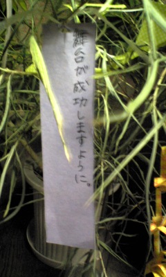

万絵巻OB・OGの皆様にDMがぼちぼち届いているということですので、ブログのほうもDM仕様に変更してみました。

というか演出さんに「できるならして」と言われました…

これからもちょくちょく細かいところをいじっていこうかと思います。

By bandy

## たなぼたと七夕って似てない？

こんばにちは、三回生のバナジウムです

昨日は七夕でしたね

七夕といえば七月七日ですが

七月の上旬はまだ微妙に梅雨にかかってます

ということは、雨・曇りになりやすいということです

では、なぜ夜空が見えにくくなる可能性が高いこの日に七夕をやるかというと

元々七夕は旧暦での七月七日に行われていて

現在の暦で８月上旬に行われていたかららしいです

まあそんな話はおいといて

七夕でもうちのチームは稽古三昧ですｗ

日に日に稽古も激しくなり、気候も夏らしくなってきてます

役者は今回が初ですが、できる限り頑張っていきたいと思います！

話は変わって今日はキャスト発表

どの役に振られるのか今から楽しみですｗ

## 道。

今日はキャスト発表でした。

希望の役をもらえた人も

そうでない人もいると思います。

私は一回生の夏、

はじめてもらった役は

希望の役ではありませんでした。

キャスト発表の直後は

ショックで動けなかった（笑）

でも今では忘れられない大事な役だし、今の自分の核になってる。

どんなに小さな役でも向き合って欲しい。

たたかって欲しい。

舞台に立てるシアワセを味わって欲しい。

なんや分からんアツイ感情がぐるぐるしているのです。

by演出
