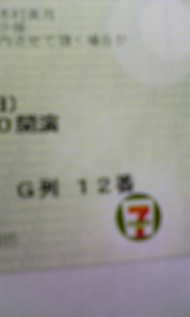
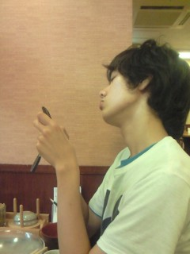

今日の稽古場の空気、

ええ感じでした。

演出におどり出てよかったなぁ…

と帰り道に思いました。

わたしも負けまへん。

それにしても。

コンビニって便利ですね！

だって、チケットが買えちゃう。

期限が昨日中だったので、

稽古後にお芝居のチケットを

購入しに行きました。

ありがとう、セブンイレブン。

これで私は大貧民＼（´～｀）／

by演出

## 高槻

初めてブログに書き込みます。サンマルク婦人こと住居です。

昨日は２１時半の次のバスが２２時半な富田バスに愛想着かして高槻バスで下山しました。

帰りに人がいっぱい居るってたのしぃ(ﾉ∀\`\*)

そして、ここぞとばかりに飯ニケーションで、candy cloonyさん、るるっと小梅ちゃん、Ｇ線嬢ザキばにら、クッキングパパとやよい軒に。

小梅ちゃんは終電のために早めに帰ってしまいましたが、残りの面子は店員さんにお皿を下げられても居座り続けました。

「気にしたら負けだ｣って誰かが言っていたのを思い出しました(他チームの方ですが)

楽しいと時間がすぐに過ぎます（･ω･\`）

写真は「メールが来なくて拗ねるＧ線嬢」

毎日遅くまで大変ですががんばっております。

そろそろ迷わずにランニングで萩谷にいけるようになって来ました。

夏バテには気をつけましょう

## 暑いですね。

暑いですね。

地球温暖化のために北極の氷が溶け、白くまが流氷の上に取り残されて3日3晩泳ぎ続けなくてはならないみたいなニュースを聞きました。

かわいそうなくま。

くまのためにCO2を減らそうよ!!

今日のお稽古は、炎天下で行われました。

皆、暑いので元気がないみたいですね。稽古場でバテない工夫が必要かも…

暑いとイライラしますよね。普段許せることも許せなかったり。

でもイライラしない方法があります。

それは笑顔でいること！

私事ですが去年の夏は炎天下でバイト三昧でした。それも、某テーマパークで。

体力的にはむっちゃしんどかったです。１時間に１度くらい水を飲まないと倒れるし、日焼けして私なんか私だとわからなかったぐらい。

でも、不思議と笑顔で過ごせました。

それは、お客様が楽しんでくれるから！

「また乗りたい」「ありがとう」という言葉が嬉しくて、職場の皆が笑顔になるんです(夏休みの勤務は通常の時給より400円増だったということはこの際気にしない)。

演劇も同じだと思います。

稽古場はしんどいことだらけですが笑顔のお客様を想像しましょう。

まだまだいけるやんっていう気持ちになれると思います。

ま、万民の前で限りなくネガティブになりやすい私が言っても説得力ありませんけど。

始まったばかりのようで本番はすぐそこです。

がんばりましょう。

ウイ
