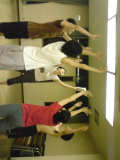
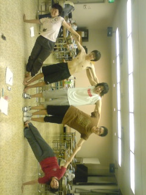

学校にて炎天下の中で稽古した後は

公民館にて稽古しました

写真は休憩中にてクーラーに群がるメンバー

でも、なんだか元気玉を求めるようにも見えますね

「おいらに力を～」って言っているようです

他にもメンバーで素敵な組体操の写真もございますが！

それはまた今度の機会に☆

出し惜しみしていきますよ(笑)

byまゆみ

## 力を合わせて

出し惜しみした昨日の稽古場の1シーン！

力を合わせれば何だってできます

見てください、この素晴らしい組体操を！

見てください、みんなの素敵な笑顔を！

ちなみに、私は人数と身長のバランス(背がちっちゃい)の関係もあり

笑顔で写真を撮らせていただきました！(笑)

ナイスなチームプレイ！

…あ、心配しなくてもちゃんと稽古やっていますよ！？

でも、こうやって気分転換も大事ですよね

おかげで今よりもっと仲良くなれた気がします

一人で芝居は作れない

昨日、電車の帰り道にて演出さんが言ってました

仰る通りでございます

芝居はチームプレイ

役者だけに限らずスタッフもそうです

みんなで芝居を作っていくんですね

だから、この夏公チームで最高の思い出を作りたいです

みんなでイトしのエリ～を愛していきましょう！(笑)

あぁ、早く夏休みならないかなぁ

でもその前にテストを乗りきらねば！！

来週からテスト期間です

色々頑張ります

どうぞ、本番の日を楽しみにして待っていてください

byまゆみ
