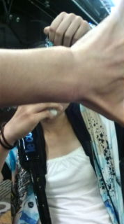
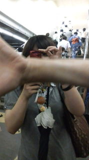
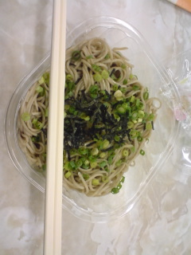

今日は天神祭だったようです。帰りの電車では浴衣姿の人がちらほら。

浴衣っていいな！夏って感じです！

さて、うちの学校では今はテスト期間中です。ですが嫌なテストも昨日で終わりました!!

ひゃっほ～い!!!

まだテストが残ってる人はがんばってください！

テストが終われば夏公の稽古だ！イエイv(^o^)

写真は今日の帰り道から。他チームの演出さんの手とイトしのエリ～チームの女優さん。

by初ブログ更新の3回生役者兼衣装

## お久しぶりです！

まだまだテストは続きますが明日は土曜日だよってことで、日付は変わりましたが稽古場日記でございます☆

本日はちょいと早めの開始でした。

ストレッチも筋トレも発声も基礎練もすごく久々！反復横とびなるものをしましたが動き鈍すぎでした(笑)

しかし、基礎練では確実な進歩が感じられました。この調子ですねっ！

さて、台本のほうはというと…徐々に細かな動きもついてきてますが、まだまだこれから！

これを通してやったらどんな感じに仕上がるのかわくわくします(\*^\_^\*)

というわけで、今日もお疲れさまでした！！

画像は帰り道の一枚。

チームメンバーのきよ様の素敵笑顔を納めようとしたら他チーム演出さんの魔の手がっ！！

またリベンジしたいと思います。

以上、三回生の濱津がお送りいたしました。

## 本日のお昼ごはん

とろろそばだと思ってたとろろは

大根おろしでした

ちょっと残念ですが、やはりお蕎麦は美味です

午後も稽古あります！

頑張りますよ！

## お先に！

昨日で一足早くテストが終わって、ぬははんっ、な気分のＧ線嬢ありまです。

これで芝居に集中できると思うと、ふははんっ、な気分です。

去年秋学期の試験結果は散々でした。今年は実りが多いといいなぁ…

語学は出席ミスってなければたぶん大丈夫。

基礎演習は演劇やってるおかげでプレゼン高感触だったし、実習なんか授業中に僕がプレゼンしたときのビデオが僕の知らないうち（！）にメディフェスで上映されたらしいので、きっと素晴らしいことになってるはず◎

今日は学校で稽古でした！　独占して使えるＳ棟のなんと居心地の良いことか。でももうすぐバス定期が切れるんですよねー…

最終的な芝居のアウトラインはまだなかなか見えてきませんが、すっきりかつ沢山の要素を詰め込みたいです。

いろいろと実験してみたいなぁ。

明日は勉強も稽古も無い完全OFF日なので、先輩から借りた芝居のDVDをみたり大阪巡りをしてきます。
