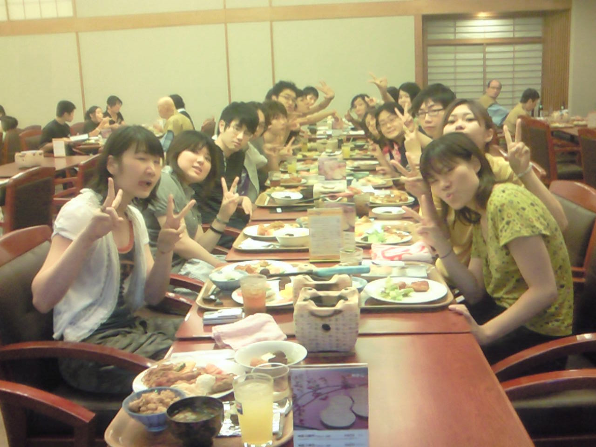

チーム旅行から帰ってきました。

旅行といいつつも旅館のひろーい部屋で稽古。

いい汗を流した後は温泉に。

次々とサウナから脱落する中、うぃさんは余裕の表情。

ご飯はバイキングでした。朴葉味噌は自分で七輪であぶって食べるんです。

お寿司もソフトクリームもありました(ﾉ∀\`\*)ケーキとプリンも。。。

足湯めぐりはできませんでしたが、お昼に食べた飛騨牛の牛串はジューシーでおいしかったです。下呂牛乳も飲みました『フルーツ味』を選んでみました。

帰りのバスは死屍累々になってました。

帰ってきたら冷凍庫が半開きで泣きを見た住野がお送りしました。
