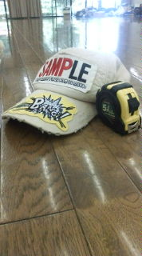

2008年度夏公演イトしのエリ～『チョコレートアンダーグラウンド』無事終了いたしました。

ご来場ありがとうございました ！！

例年より一週間早いからでしょうか、どどどっと時間が流れていったような気がします。

最後の一週間なんかほんとに怒濤でした、はい。

大道具として、役者として、三回生として反省点は数え切れません。

チーム結成時に演出様が「待ってる奴は跳び蹴りします」という冗談(？)を仰ってましたが、ほんとなら私は前屈とは反対方向に折れ曲がっているでしょうね。

これからはもっとちゃんと周りを支えてあげられるような上回生でありたいものです。

今はなぜだか夢心地です。

私はほんとにあの舞台に立っていたのだろうかと、感覚がおぼろげです。

うーん、不思議な感じ。

でも最後の台本を渡されたときにこのラストシーンに出演できるのかと幸せを感じたのだけははっきり覚えてます。

楽しいお芝居でした。

三回生の濱津の反省でした。

ではでは、ジューシーオレンジ気分をどうぞ！！

