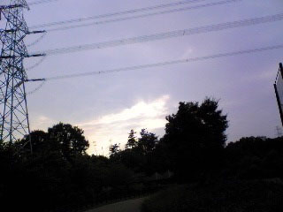

こんばんわ！４回生エりんこです。

今日は演出さん不在の自主練習でしたー

いつもは学校→萩谷公園→月見台→学校というコースなんですが、今日は気分を変えて、学校→西ノ口→月見台→萩谷公園→学校コースを走ってみました。

上り坂がいっぱいでしんどいっ

月見台から萩谷公園までの道。

普段は公園から月見台なんで、虫が多い下り坂の部分はちゃちゃーっと過ぎ去るんですが。

･･･ちんたらふんばりながら上っていると･･･両サイドから獣か虫かわからないんですけど、ガサガサっという物音が･･･（ひぃぃぃぃ）

早くこの坂登りきりてぇ！！！走れっ走れっ、足が思うように動かないっ、でも走れっ

途中。

ビュンっビュンっ

！

何かと思いきや雀。虫を必死で追っていました。

私の周りをすんごぃ勢いでグルグルびゅんびゅんグルグルびゅんびゅん。

雀って可愛いなぁと思ってましたが、結構凶暴。

自然界は厳しいんですね。

汗だくになって学校へ戻り、縄跳びの練習、柔軟、筋トレ、発声を終え、立ち稽古。

19時過ぎ。

１回生のサッカー少年ライス登場！！

やっと人が来てくれた（泣）

実は１人寂しかったっ

それからは秘密のライス特訓です！

きっと明日の稽古では今日の成果を発揮してくれるでしょう♪

さぁて、次のバスは21時30分！それまでないっ

C棟でTシャツ制作の続きをやりますか(>∀<)/
