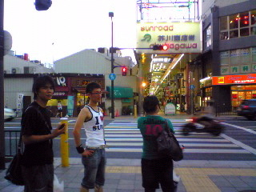

今日は公民館での稽古終わりに、７月末に予定しているキャンプ用品の買出しに行きました☆
まず百均で雑貨購入～。

そしてソースやホットケーキミックスを買いに、駅前のスーパーへ。

百均で売ってるんよりは大きいけど･･･丁度いいサイズがない･･･メープルシロップ高いしっ

ＵＮＯ：「業務用スーパー行った方がいいんちゃうん？」

ゆみん：「業務用スーパーってどこにあるんですか？」

ＵＮＯ：「芥川の近く･･･ぁー最初からそっち行っといたら良かった!」

ゆみん：「しんどいけど、ちょっとでも安い方がいいですぅ～」

というわけで、再び芥川公民館方面へ。

写真は、芥川公民館のさらに向こうにある業務用スーパーを目指すpure summerメンバー（苦笑）

途中ＵＮＯさんにガリガリくん梨味を奢ってもらって（ガリガリくん初めて食べたけどめっちゃ美味しかった）トコトコ歩いてやっと業務用スーパー到着☆

・・・

・・・

普通のスーパーじゃね？

ＵＮＯ：「普通と業務用の間やねんって!」

なんだかんだで、大きいオタフク焼きそばソースあったし、ホットケーキミックス安く買えたし大満足です（´∀｀\*)

キャンプ楽しみ～♪♪♪

by エりんこ
