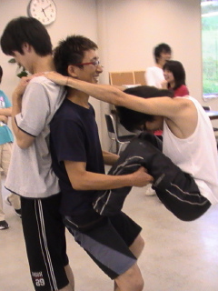

今日は夏休み入って、初練習かな？キャンプのぞけば、

今日はＳ棟内で主に練習しました。

柔軟、縄跳び、発声、基礎練、台本

タテを練習しました、初めてですｗ

がんばって大きな声で噛まないで最初のセリフ言えるようにしますｗ

あとはいろいろやりつつ、、、たくさん人が出るところをみんなで考えたりしました、（画像）

稽古終わり、エりんこさん、けんすけさん、きっしーさん、ジョイカムさん、ゆずポンさん、自分の6人で お寿司食べて買えりーした

でわーお休みなさい(。・ω・)ノテュイー

byライス

## そうですね、画像張るのわすれてました

張りり
