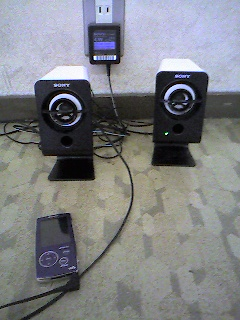
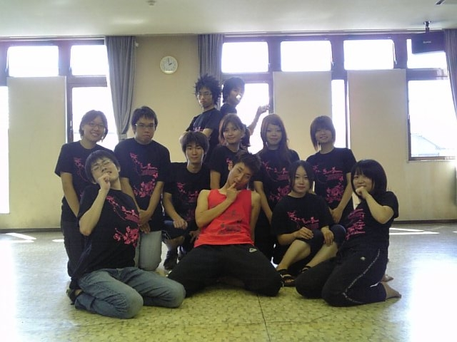

だんだんと音楽を流しながら稽古してます！

雰囲気が少しずつでてきた…？

とにもかくにも頑張ってます…

けんすけでした！

## チームTシャツ到着！

広報エりんこです。

今日ついに！皆からアイディアをもらい作り上げた、我がチームTシャツが到着しました～♪

普段にも着れる「和モチーフを洋風に」お洒落Tシャツがテーマですｖｖ

自分が作ったTシャツを皆が着てくれてるのを見ると、すっごく嬉しいです (´▽｀)

しかも１枚1200円とリーズナブル☆

これでチームも一致団結！

本番に向けて頑張るぞぉ(●´ω｀●)

## ピカチュウ！10万ボルトだ！････え、死ぬって!!サトシ、それは死ぬって！

公民館練習後、芥川の河川敷で稽古☆

夕飯食べて、もりもり稽古だぞ！

河川敷で皆でご飯を食べていると･･･東の空に暗雲が･･･

ピシャーン！！！！！！ゴロゴロゴロゴロゴロ

空に稲光が走る。

やべーなぁ、と言いつつも食べ続ける我ら。

ピシャーーーーーーーーン！！！！！！

ピシャーーーーーーーーン！！！！！！

ピシャーーーーーーーーン！！！！！！

ピシャーーーーーーーーン！！！！！！

気付けば四方を雷雲に囲まれていた･･･

空気を裂く、稲妻の爆音。

目の前で眩しく光る雷フラッシュ。

ピカチュウ恐いよ！

今まで、「フラッシュ」とか全然つかえへんし、体当たり覚えさせとこーとか言ってたけど、「フラッシュ」マジ恐い･･･びびるって。

数分後、スコール襲撃。

びっしょびしょやわ。

４回生エりんこ。

ひと夏の思ひ出がまた１つ増えました。
