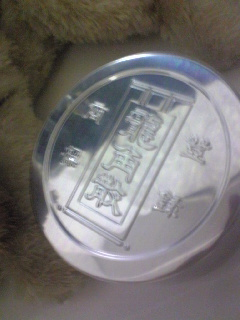

今日は２回目の通しでした！

チームの皆さん、お疲れ様です。

観に来て下さったOBの方々、ありがとうございました☆

もう危機感でいっぱいです。

後１週間で俺たちは変わる！

通し後、johnさんチームと公民館入れ替わり。

久々に他のチームの人を見てテンションUP↑↑（笑）

マクドで今日の通しの反省会。

OBさんからのありがたいお言葉。

自分たちが感じたこと。

これから俺たちがどうやって変わっていくのか。

後１週間で俺たちは変わる！

魅せてやるぜ！俺たちの紅天狗！！！

byエりんこ

## 喉が…

悲鳴を…

空気が悪いとすぐ喉を痛めます。

本当に声が出なくなったらどうしよう。。。

体調管理出来てないですね…

やろうとしてるんですが、結び付きません。。。

咳、喉に効く風邪薬を飲んでいるのですが、一向に効く気配なし(´・ω・｀)

喘息？？

お盆で月曜まで病院開いてないし…

早くなんとかしたいっ

ということで。

ＵＮＯさんオススメの龍角散を摂取してみることに。

最初はクサッ苦っうぇーってなったけど。

私、駄目じゃないわ。

やけど、即効性はあるけど、持続性がない気がする。。。

ラスボスを倒さずに、ラスボスが放つ雑魚キャラを倒してってる感じだ。

ま、とりあえず、龍角散の力を借りよう。

明日から龍角臭するやろけどみんな許して…

byエりんこ
