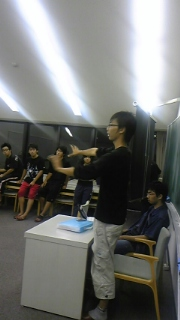
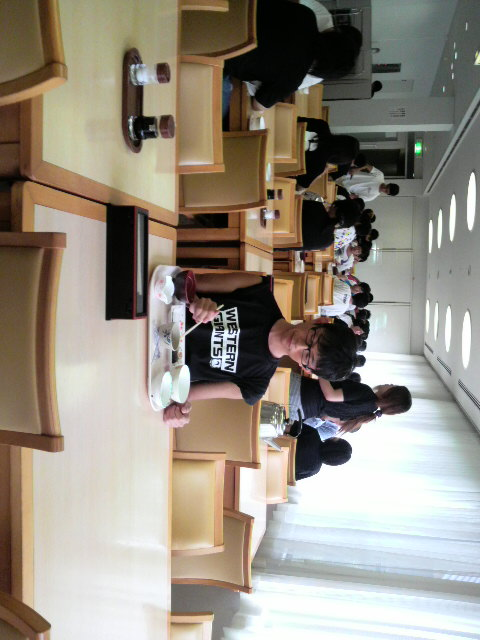
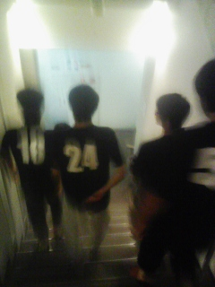

今日は最終稽古でした。

早い。早過ぎる。

高岳館にいると、今までの夏の思い出がよみがえってきたりします。

万絵巻での最後の夏です。

イトウエリ

## 本番当日

いよいよ本番の日です。

写真は朝ご飯を食べる孤高の戦士です。

さぁ、全速前進！

## 朝の日差し

みなさんおはようございます。小道具や衣装など最後の仕上げをチームみんなで終わらせ、大道具班はゆうしさんの王将トークを丸一夜聞きながら、無事本番の朝を迎えた有馬です。

本番直前に現品完成していく様子を見ると、どんだけしんどくても広報チーフやってよかったぜぃまた次もよろしく！　でももしよければ次回はもうちょい仕事減らしてくれると兄さんうれしいなぁ、て思えます。手伝ってくれたみんな本当にありがとう。

ところで今回の巨人軍チームＴシャツ、実はひとつひとつに背番号入れてみました！　遠目からみると新手のプレッシャーを覚えます。

本日15時、 24人の巨人がくそおもろく大侵攻しちゃうんで、よろしくお願いします！！
