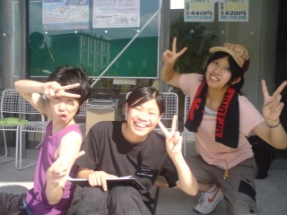

日付が変わってもう３日です。あぁ、稽古疲れた。

こんばんは、日焼けでヒリヒリして涙目のマユミです。

今回は勝手に役者の紹介でもしようと思います。

紹介するメンバーは写真にも写っている「付き人A・B・C」の４回生！

右からつづりんさん（付き人A）、みやけさん（付き人B）、バンディーさん（付き人C）。

全員４回生で固めるなんとも贅沢なキャスティングになっております。

個人的に３人が繰り広げるお芝居が楽しみで仕方ありません。

写真を見てもわかると思いますが、とてもノリノリな４回生です（笑）

それぞれ忙しいのに、３人が楽しく打ち合わせしている姿がとても印象的。

実はMBPをこの３人が掻っ攫っていくんじゃないかと内心ヒヤヒヤしてます。

私も負けてはいられませんね！！

さてさて、話は変わって４日はなんとはまタンチームのキャンプの日です！！

まだ準備全然してないや・・・

キャンプの日記も随時更新しますので、まったりとした気持ちでお付き合いしていただければ幸いです。

それでは、ここら辺で失礼しますm(\_ \_)m

by　マユミ

## 読み合わせ！

こんばんは、役者兼道具の1回生・イーサンです。

本日も、大学構内での練習となりました。

体操、発声練習、基礎練習を終えて、本日は時間の目安を計るための読み合わせ。時には小ネタを織り交ぜながら、または先輩方の小ネタに笑いを堪えきれずに、やりきりました。時間としては、ちょうどいいくらいでした！

本稽古は4時に終了。その後は自主練習に。

さて、稽古後の自主練習ですが、開始前はカオスでしたι

開始前の雑談で、**下ネタ**が出るたびに、**爆笑**し**悶絶**する私。極限状態にまで陥ってしまい、とんでもない事態に……OTL

しかしながら、演劇のほうも、先輩方からアドバイスをもらい、稽古に励みました。でも、最後には失速してしまいました……。

さあ、明日はキャンプです。楽しみながら、稽古に励んできます！

以上、先輩方はうまい！　と思いつつ、よくコピーになっているイーサンでした。
