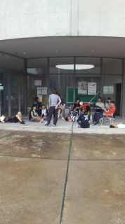
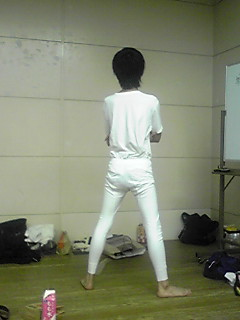

お久しぶりです！

演出のはまっちです。

日付変わってしまいましたが、

本日は二回目の通し稽古でした！

台本を離しての通しは初めてでしたが、台詞のほうはみんな問題ないようです。

今回の台本、台詞量がかなり多いのですが、みんなやってくれますね！！

今の課題は集中力です。

大切ですね。

そしてそして、初の公園稽古も行いました。

雨上がりでちょうどいい涼しさで助かりました。

そこで、３回生のしぃちゃん＆すみぃちゃんがカキ氷大会を企画・実現してくれました！！

感謝ｖ

大量に氷を買い込んで、一生懸命ガリガリ削って、シロップたっぷりかけて・・・う、うまいっ！！

夏はやっぱりカキ氷ですよ！！

ほんま粋なことしてくれますわ～♪

そうそう、粋といえば、なんと今回チームオリジナルテーマソングを作ってくれちゃうみたいなんです！！

感激ですね～。

写真は一昨日のものですが、テーマソング歌詞作成中の午後のひと時です。

今までで一番チームがひとつになっていたように思いました（笑）

## こんばんは！

こんばんは！

稽古がしんどくて、もうみーんーなしーねーばーいいのにーむらかみでーす。

今日は昼から夜まで稽古でしんどくて、もうみーんーなしーねーばーいいのにーむらかみでーす。

えー、最近北斗の拳の格ゲーが面白いですね。

世紀末すぎてもうみーんーなしーねーばーいいのにーむらかみでーす。

以上、むらかみ紛したもるつでした！

はい、本物のむらかみですこんばんは☆

もるつも言ってた通り今日は一日稽古!!みんなお疲れ様でした。

そんな中何やら素敵な後ろ姿が…(笑

※写真参照

いやぁ、カッコイイですね(^^)v
