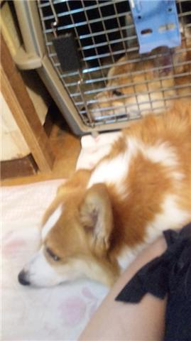

へい。こんばんわ。

みやけです。

本日は演出不在でしたがみんなで自主練してました～。

またの名をワークショップという。

で、今日を通して思った。

うちのチームは下に溢れている、と（笑）

下担当の人から今日の稽古の予定の連絡が回ってきた時も、

「ワークショップを中心に繰り広げるアクションファンタジーちんこです！」

とか送ってくるし。

さらに実際の稽古場では本気で「ちんこちんこ」言ってましたね。

文章だから書けるけど恥ずかしいわｗｗ

もう、下言いすぎてかわいい１回生が引かないか心配ですね！

が

これで強くなる、とも言えます（笑）

・・・これだけだと下品な稽古しかしてないみたいですけど実際はいろいろやりましたよ～

他の役をやってみたり、お互いダメ出ししあったり、収録したり、小道具作ったり、通しビデオ見たり、盛りだくさんでした。

明日は公開ゲネ。

お客さんは少ないかもしれないけど、それでも見てくれる人は段違いに多くなりますね。

緊張もしますが、それ以上にわくわくもするぜぃ。

久々に他のチームさんにも会えるし、楽しみですね。

皆さん、頑張りましょう！

追伸

写真の絵は私の家のわんこです。

かわいければいいじゃない！！
