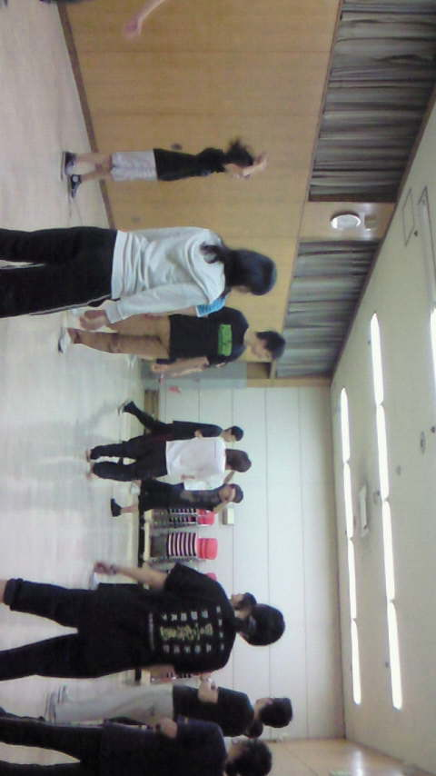
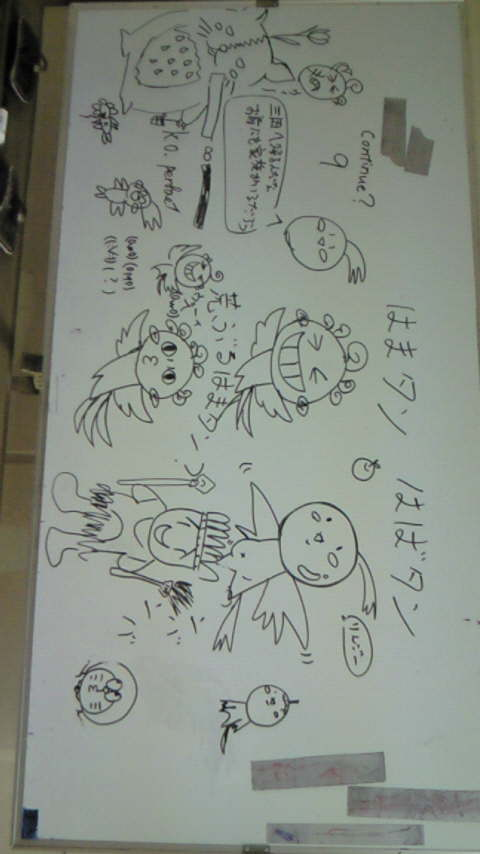

昨日の稽古場はふれあいセンター小ホール

狭すぎず広すぎないよいところです

休憩後の気分転換に名前鬼が始まりました

テーマは｢動物｣。

犬からティラノサウルスまで、多彩な動物(？)が集まりました!

そんな生態系の食物連鎖の頂点に立ったのは…猫?!

シマウマがハムスターを捕食する?!

厳しい自然環境を彷彿とさせる、のほほんとした名前鬼でした。

話はかわりますが、ふれあいセンター小ホールには、ホワイトボードがあるんですよ。

手空きのスタッフやら役者さんやらがはまたんを書き出したら、最終的には写真のようなフリーダムっぷりになりました（ﾉ∀｀;）

裏には１回生じげＤによる似顔絵の独壇場でした。しかも上手!

## ！？

先日音の編集をしていたら、身長180以上の4人、D4に囲まれた身長150未満のはぐちゃんです。

何が起きたのかわかりませんでした。

今日は11時から4時まで学校で稽古でした。

毎日暑いですね・・・

自販機のジュースがほとんど売り切れで選択肢がどんどんなくなっていきます。

今日はウルトラサイダーが流行っていました。

本番まであと・・・3日！？

頑張りましょーう（＊＾＾）ノ
