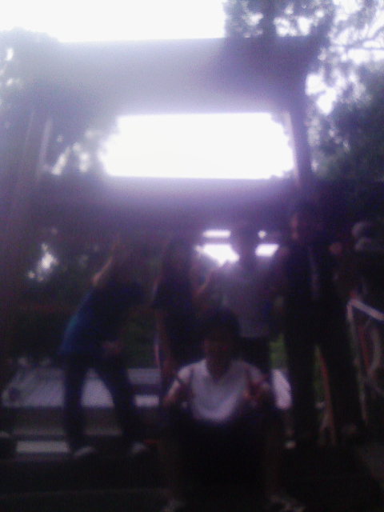
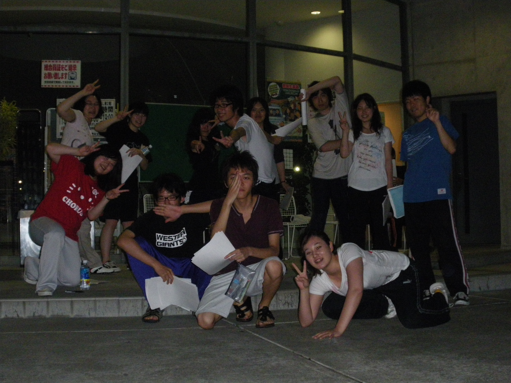
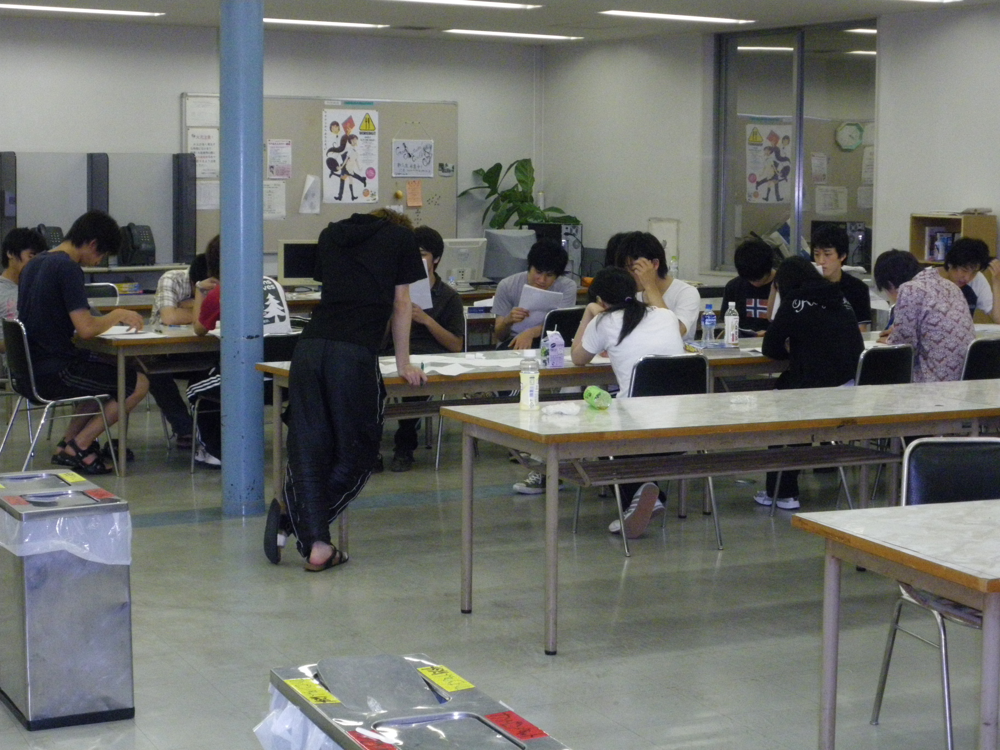
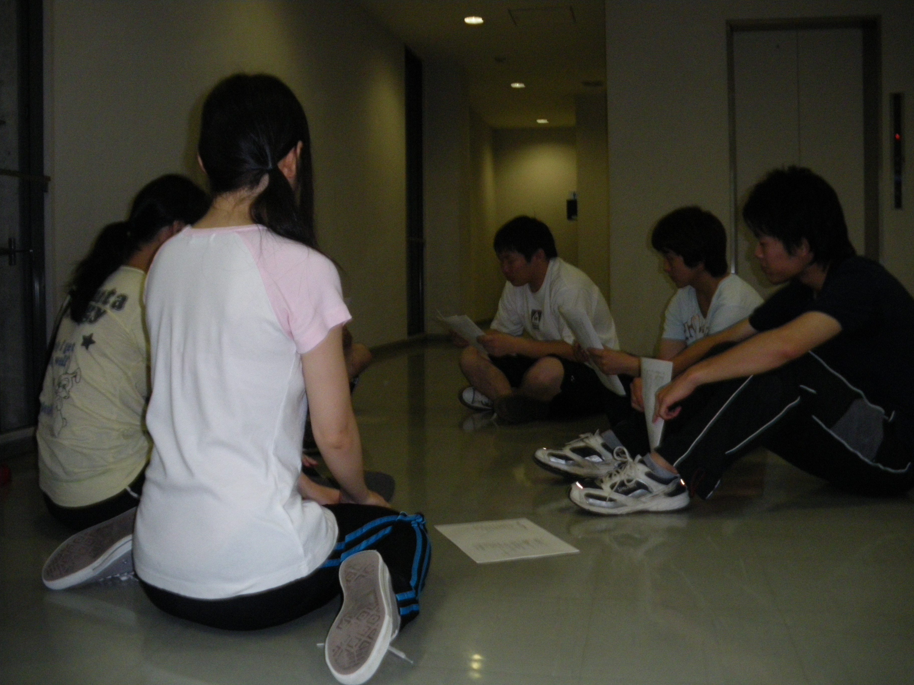
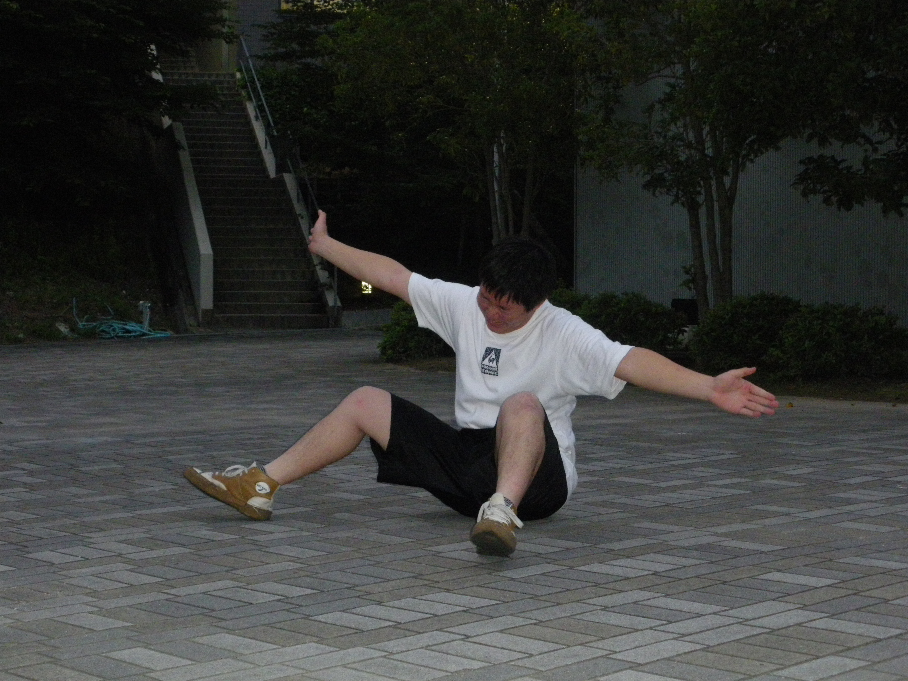

ザキ有馬よりチーム有馬記念のブログをスタート。

恐らく万絵巻では最後の演出、一発デカいのかましますよ！

さっそく７月頭の稽古日記！

まず萩谷の神社を往復ランニング。あの道を上ったことがある人はわかると思うけれど、ラストの坂はまさに心臓破り。限界を５回ぐらい越えねば登りきることはできない登竜門です。

フォームを維持しながら走ろうとすると最後には背筋がピリピリします、背中から翼が生えるんじゃないかってくらいの刺激。

写真は往路２５分でクリアした若馬たちの記念写真。あの神社までノンストップで制覇する体力さえあれば、どんな芝居も乗り越えられるはず。ポニーからサラブレッド、そしてペガサスへと進化せよ◎

ランニング後のメニューはアメンボbox→ケツ噛みbox、ほめるけなす、階級エチュード、たこはち。

チーム有馬記念は、基礎練メニューについては毎回上質のものを組み立てている自信があります。

質がよければあとは量！　とにかく回数をこなし、そのなかで自分自身で必要なものを洗い出すこと。そして毎回最大レベルで挑むこと。

そうすれば誰にも負けない、ビッグタイトルを片っ端からかっさらう競走馬になれるのだ。

出走まであと２ヶ月、名馬若馬揃っております。

夏公最終レースをお楽しみに！

## チームメンバー紹介！

広報２回生のマーリンです。

今日はザキ有馬さん率いる、有馬記念出馬の面々をご紹介します。

いえーいみんなテンション高いぜやっほーい！！

この夏はこの楽しい面子と一緒に過ごします☆

うそです。我がチームの演出はキティちゃんのTシャツを着こなせるほど可愛くないです。これはチーム幼女（仮）の方々でした。

こっちでした。

今日は四度目くらいの読み合わせをやりました。

台本超おもしろいです最高です！！早く舞台でこの台本やりたいー！！！

というのもうそです。我がチームは一ページさえ台本もらってないです。

これはモルツさんチームの方々でした。台本いいなー

これが本物です。

一回生と楽しく台本読みしてます。

・・・！だいほ・・ん！？

ついに一ページ目が配られたのか！？！！

勿論そんなことはなかったです。一昨年に学学展万でやった、「熱闘！！飛龍小学校」の台本でした。

みんな小学生気分で楽しく読み合わせしました＾＾

おまけ

毎日ミューズキャンパスから登山してくる、一回生きむ（もしくはピアニカ）君による一発芸
