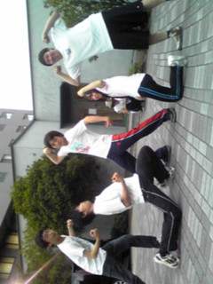

本格的な夏ですね!!

こんばんは村上です。

さてさて我らチーム有馬記念、今日もテンションアゲアゲな稽古場でした☆

今日のメニューは

・柔軟

・発声

・たこはち、セブンボーズ

そしてっ…

『サーキットトレーニング』

詳しい解説は後に誰かが書いてくれるでしょう。そう信じてるっ。

写真はマッスルポーズを華麗に決める１回生たち。

夏が終わる頃にはムキムキになってる事でしょう(\*´艸\`)

## 自己紹介シリーズ第一段！

ごきげんよう、二回生のへむへむです！

本日の稽古終わりに演出から「自己紹介をブログに書け」という宿題をいただきました

ちなみにうちは「フェチについて箇条書で語れ」というお題をいただいたので語ってみますｗ

演出命令には逆らえませんからね、ふふふｗ

フェチについて

・鎖骨

　つい見てしまう

・うなじ

　普段見えないところが見えるとキュンとする

・手

　楽器弾いてる手とか大好きです

・腕筋

　力入れたときに若干筋が見えるくらいがちょうどいいです

・足筋

　走ってるときに若干筋が((以下略

・黒ぶち眼鏡

　たまらん

・スーツ

　ベストもあるとなおよろし

・着物

　ギャップ萌え

・ツンデレ

　正義

・・・・・・まぁもう少しありますが自重しておきます＼(^o^)／

ここからちょっと真面目な自己紹介！

普段は主に役者、制作をやってますが、挑戦の夏公ということで、今回は役者に加えて小道具と音響というスタッフワークに初挑戦します！

これでやったことないスタッフは照明と衣装と舞監だけになりました、やったねッ(^ω^∪)

あと演出さんご指名で演出補佐という仕事も与えられたので、この夏は学びの夏にしたいと思います

うちのチームはほんま筋トレしながらボカロ曲をみんなで歌っちゃうぐらい仲良し＆テンション高いんで、どうぞこの夏有馬記念にご期待ください！

## 痛い痛い痛い！

体の節々が！反乱…を…っ！

はい、もう身体年齢は実年齢＋１０なことが身に染みた四回生のnoriです。

さっき村上がサーキットトレーニングの説明を後続に丸投げしやがったので、まずはその処理をしたいと思いますｗｗ

まぁ、簡単にいうと、腕立て腹筋背筋馬飛びその他のメニューをぶっ通しでやるという、実にすばらしい、よく考案した人刺されなかったなと思うような鬼筋トレです。

しかもそれを三回。。。演出ゴルァってなりかけましたが我慢我慢。これも芝居のためチームのため。しかし俺今年でにじゅうよ（ｒｙ

あ、一つだけうれしかったことは今日中に筋肉痛が来たことですね！まだ若い！イタタ…orz

まぁそんなんで、自己紹介？ですか？

ずーっと音響をやってきましたが、今回が最後の夏やし何かほかにもやりたい！ってことで、演出補佐というお仕事をいただきました。ヘムも補佐ですが、有馬と三位一体で頑張っていきたいと思ってます！

あ、もちろん音響も頑張りますよ！自費で新しい何か入れちゃったりフフフｗｗ

ま、めっちゃ楽しい有馬記念のお芝居、どうぞご期待下さいませ！
