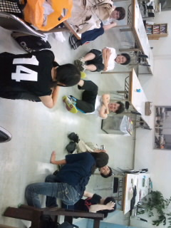

「みんなブログを書こう！」

という演出さんの呼びかけに応えて書いてみました、一回生の課長です

演劇自体初めての経験なので、稽古でいろいろ勉強させてもらってます

稽古、本格的ですね(^-^)

この夏、有馬記念で頑張っていきます！

今回、広報をやってみます。先日も広報の講習会に行き、itoxさんにイラレを教えていただきました。

めっさ便利です!(b^ー°)

写真はサーキットトレーニング(の再現)をやってるメンバー＋ザキさんのアップを撮るマーリンさんです

うまく載ってるかな？

他の一回生も自己紹介を書いてくれることを期待します

こんな感じで良いんでしょうか？

では、

チーム有馬記念をよろしくお願いします

課長でした　ノシ

## 好きな馬はエルコンドルパサー

チーム名がまさか競馬関連になると思わなかった、ご存知競馬大好きお兄さん２回生ガリオです。

サーキットトレーニングとやらでヘトヘトなうです。でも俺の体力のせいじゃないです。ニコのせいです。俺は悪くない。

自己紹介せよとの事らしいので、簡単に

・２回生

・音響メイン

・競馬大好き

・身長177センチ

・体重50.4キロ←

やべえ、マジ消滅の危機だよ。

ある意味体重計に乗るのがイヤになってきたよ。

今からトンガリコーン食ってきます。考えついたら即行動。これ大事。

稽古場の雰囲気は……まあ他の人が書いてるように、良好な感じです。

キャンプがまだ全然白紙なのが気になりますがね。

良好な旅行が行きたいです。

はい、これが言いたかっただけですサーセンｗｗｗ

黒々とした文章で失礼しました。

画像？…んなもんあるわけないでしょ（＾ω＾）

## 一回生自己紹介第二弾！

どうも。はじめまして！

一回生のことねです。

今回の役職は

役者と小道具です(^ω^)

これからも役者は続けていきたいなーと思っております＼(^ ^)／

あー何書こう？

あ、稽古は毎日楽しいです(´∀｀)!

走ったり

サーキットトレーニングしたり

基礎練したり

歌ったり

お姫様抱っこされたり

がりおさんにジュース奢らせ…奢っていただいたり

産卵する先輩を眺めたり

一発芸をやらされる同期をニヤニヤ見たり

でも明日は我が身かもしれないとちょっと怯えたり

してます！

課長も書いてましたが

大学演劇はやっぱり本格的で

今日は何やるのかな～って

毎日わくわくしてますｗｗ

体を動かすのはわりと好きなので

体育会系テンションも楽しいですしね♪

とりあえず

早く台本が欲しいです！^ ^

我らが演出、ザキ有馬さん指導の元

私たち１回生のひと夏の成長っぷりを

存分にお見せ出来るであろう夏公!!

ぜひぜひご期待ください(^ω^)
