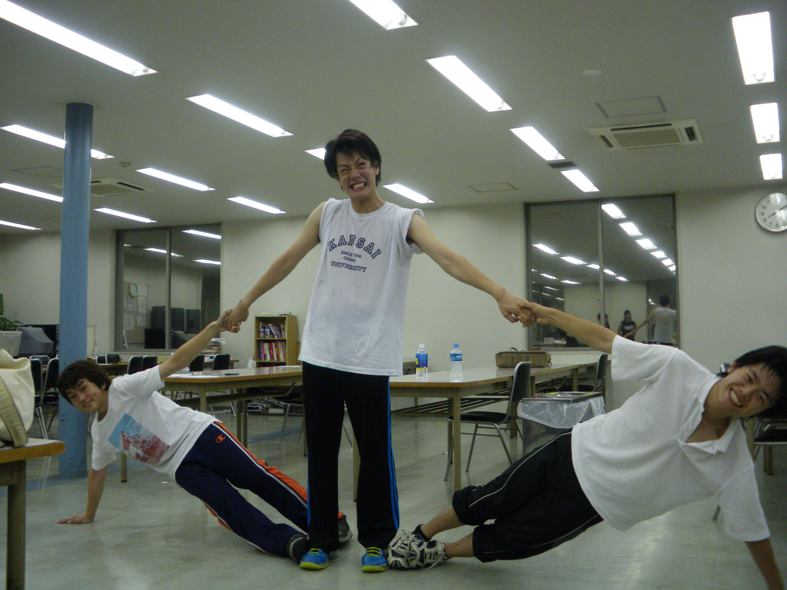
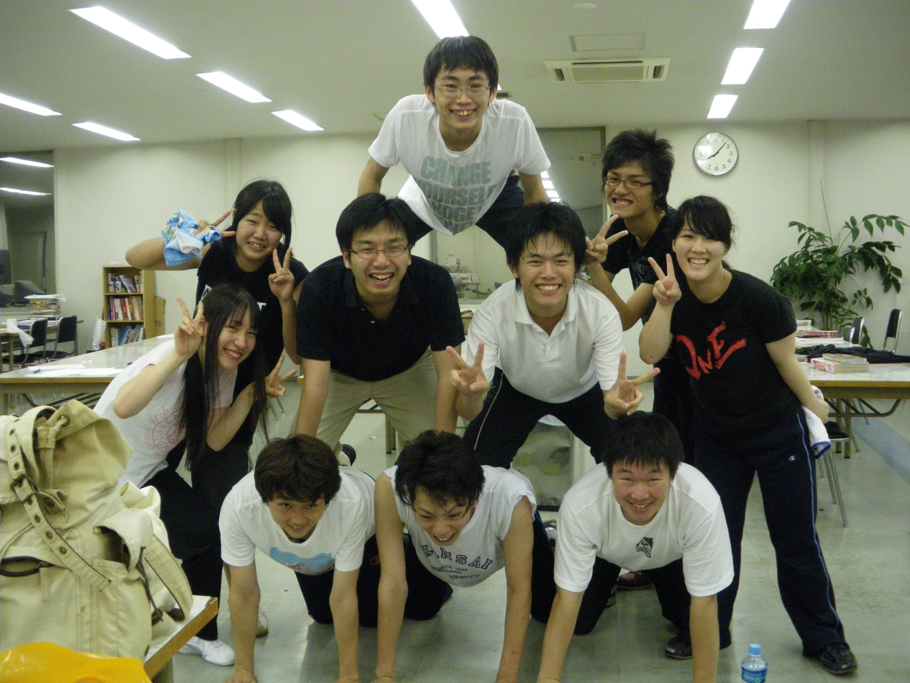

ガリオです。チーム名繋がりで競馬ネタをば。

明日は阪神と福島の競馬場で重賞競走があるのでその中でも面白そうな阪神の展望でも。

阪神競馬のメインレースはプロキオンＳ（Ｇ３・ダート1400m）

注目は何と言ってもナムラタイタン。ここまで６戦して未だ無敗、そして６戦全てが完勝といった怪物で、重賞初挑戦ながら前日オッズでも圧倒的１番人気と、初重賞制覇を狙います。

打倒ナムラタイタンを目指す１番馬はサマーウインド。ダートでは１度負けたのみで、抜群の安定感を誇る馬です。

更にそのサマーウインドにダート戦で唯一土をつけたのがグロリアスノア。アラブ首長国のドバイで世界の強豪相手に４着と健闘した馬でもあります。

人気はこの３頭が抜けてますが、他にも古豪ダイショウジェットや、若き３歳ダート王マカニビスティーなども参戦し、とても面白そうなレースになりそうです。

発走は11日15時35分。フジテレビ系列で中継あるのでよかったら見てください。

## 近況みたいな

２回生のまーりんです。今日も高槻は平和です。キャンパスでは蝉が鳴いていました。

ここ最近毎日学校へ来ているのに、先週出た授業を数えてみると２コマだけでした。テストこわい

今日は稽古お休みでした。写真はいつかの。

うちのチームは基本的に水・土・日は稽古がありません。週休３日制。ゆったりや。

とは言いつつ、他のチームも今のところは土日がお休みのようで、週末はチームメイト以外とわいわい遊んだりしているようです。

21日から月末までテスト期間なので、本格的な稽古はどこも８月に入ってからでしょうか。

そんな感じです。
