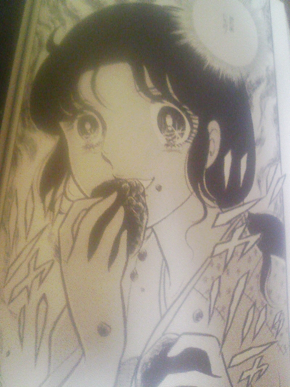
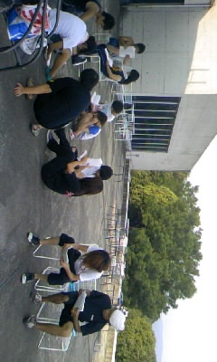

のこり１週間となりましたね、ううむ。

タイトルのセリフと写真はガラスの仮面より。

『伝説の演劇大河ロマン！』のあおり文句どおりコミックス巻数４０を越えなおも続くマンガですが、いちいち描写が極端なのはご存じの通り。

しかしあながち間違っていないので、すべての演劇人はガラスの仮面を読んでもいいなあと思うのです。

一時は大河ドラマの主役格に抜擢されたマヤが芸能界を追放され、演劇をやめたい、とまで言ってしまったマヤが、代役として１シーンのみの出番の乞食として最後の舞台を向かえる。

しかし一部の役者のひがみから、小道具のまんじゅうが泥団子にすりかえられてしまう。

焦るスタッフ、しかし舞台は『千も万も虹色の世界を生きる世界』。

今までのマヤとしての辛い思い出悲しい感情がすべて吹き飛び、彼女は舞台上でトキそのものとなる。

役者としての本能に再び目覚めたマヤは、マヤではなく乞食のトキとして、本気で泥団子を食べたのだった……

本能で舞台を動き、本能でお客さんの目線をさらう。

パフォーマーでありながらも、一生命でありつづける。

しかし何故ガラスの仮面では乞食の役が、さも『俳優が一番やりたくない役』として扱われるんだろうか？

## 演出仕事の都合ゆえ

タクシーで稽古場へ

ぞいかむチームが目の前よこぎった！

真上公民館いいなぁと思いつつ、きょうは日曜学校稽古なり。

## 初荒通し！

が終わって、ダメだし中です

大道具置き場ではブラックボックスが殺陣練＆作業中！

明日は公開ゲネ。どこも大詰め！
