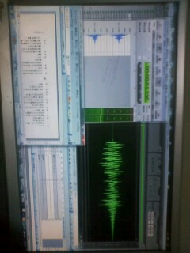

はいどーも、音響です。

現実逃避もとい作業の合間の休憩中にブログでも上げてみたろうかという企画。

写真はこれまで俺を支えてくれているメインパソコンの画面。右上の緑の波形がauditionというソフト、んで左上がsoundengineという、どちらも音編集ソフトです。今は効果音をこれで編集してるわけです、はい。長さ変えたり、音を高くしたり低くしたり、まぁ稽古で見てきた役者さんの動きを頭ん中でシュミレートしながら音を作っていってるんですよ。

左下は台本データ、んで右下がキュープランっす。だいたいこういう配置で私こと音響は作業してるわけです。

というわけで、音響さんの作業紹介でした！

ゲネやばいやばい！
