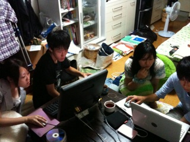

どうも、セブンボウズに置いて万絵巻現役最強の称号をゲットしたパッサです。

いえね、16日に三チームが集って合同稽古をやったんですよ。

その時に「最後の一人になるまで皆さんにはセブンボウズをしてもらいます」みたいなアレな流れになって、ソレでなんか最後の一人になったんです。

そんな私は昨日の稽古では、セブンボウズでミスをしまくってました。

ええ、今回のブログ更新は16日の合同稽古の話でありません。

17日の個別稽古の話です。

フヒヒ。結局合同稽古の話をブログのネタにするチームは居ないんだよ。フヒヒ。

昨日は、基礎練後は未だ付いてない殺陣を付けて貰ったりしてました。

その後、18：00から目を瞑って、四つん這いになり、地面を這いずり回りながら、人の気配を感じたら「火傷するぜ！」と言う、傍目では謎の稽古をした後、：30からランスルーをするー(笑)ことに。

あえて余談にしますが、ランスルーの直前にイトさんが来てくれました！

粛々と進むランスルー。演出さんは音響との話し合いのため、離れたところからこちらの様子を伺っていました。

それぞれに課題が残るランスルー後、演出さんから駄目出しを受け、イトさんからの差し入れの棒アイスを皆で仲良くしゃぶりました。

別に卑猥な意味ではないですよ？卑猥に感じる人は純粋な心をどっかに落としてきてしまったのです。

昨日の稽古はそのような感じでした。今日は通しがあります。

出来れば昨日のランスルーで見つかった課題を上手く消化できた通しにしたいものですね。

## 広報講習二日目！！

皆はね！！オイラはただの家主ですよ！

あれ、オイラ暇じゃね？暇だよ？紅茶入れてくる ノシ

## 不安をぶっとばせ!!

毎日、暑い日や寝苦しい夜が続きますね。

それはさておき、こちらでははじめまして！　2回生のイーサンです。よく間違えられますが、「イーさん」ではないのでご注意を(笑)

本日も、OB・OGさんが稽古場に来てくださいました。OB・OGさんとの基礎練習では、ボーズシリーズと名前鬼+しゅんさん(仮)を行いましたが、頭が混乱しまくってもう大変でした。

台本稽古に入ると、本日予定されていた通しの代わりに、あやふやになっていたシーンを詰めました。まだまだ不安がありますが、それでも課題を見つけ、消化する日々でございます。

気がつけば、長かった夏公演の稽古もあと一週間ですね。ちなみに公開ゲネまであと4日です。

本番まで時間がありませんが、いかに不安をぶっとばすか。役者としての踏ん張りどころです。
