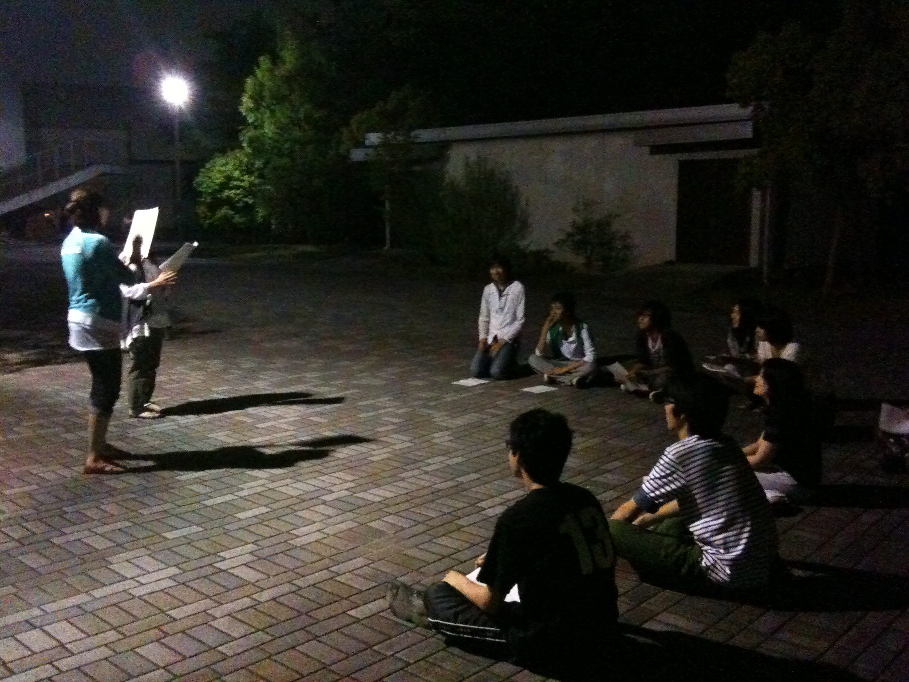
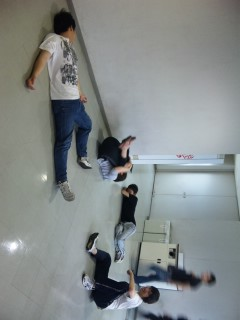

itoxです。

21日より、joycomeチーム始動しました！チームもブログもよろしくお願いします。

さてさて、さっそく稽古はじめてます。

今回の写真は、台本読みの練習風景です。

過去公演の台本を使って、キャラ作りや演じ方の練習をしています。

なんとも懐かしい雰囲気がしますね。

と同時に後輩のテイストが加わり、新しい雰囲気がそこに生まれていました。

そういえば、お寿司屋の帰りに、「演出やろうと思ったきっかけは？」って聞いてみたんです。

彼女は「今までいろいろ先輩から教えてもらったから、今度は後輩に教えていきたい」って言ってました。

先輩のテイストを引き継ぎながら、そこに後輩の新しいテイストを加えていく。

この夏の終わりに出来上がる美味しい演劇を、乞うご期待ください。

## 晴れのち雨、公園のち寿司

夏公稽古2日目です。

今日は体力づくりに萩谷総合公園までひとっ走りしてきました。

帰る途中で公園の中にアスレチック発見。

年甲斐もなく滑り台ではしゃぐ、18～22歳。

「この遊具は5～12歳向けです」そんなこと知ったこちゃない(笑)

そのまま遊具の上で発声。景色が壮大！山しかない！

今度はデジカメ持って行こう。

学校に戻って、ストレッチ、タコボーズ、台本読み

その後は・・・

## 腹筋…！

こんにちは。演出初ブログです…！

初MLも初ブログも初ご飯も奪われ演出涙目です。

今日も今日とて稽古です。昨日は足を鍛えたということで今日はお腹をいじめてみました（笑）

めざせムキムキ！！

夏終わりには皆マッチョになってることでしょう…。
