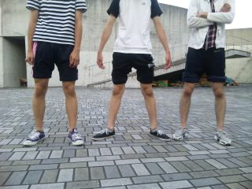
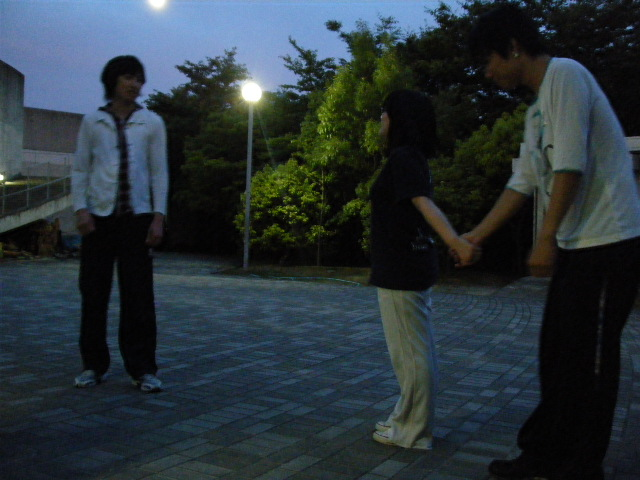
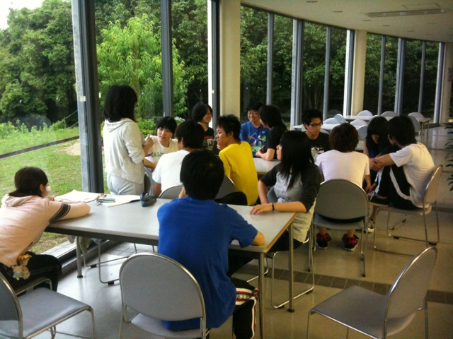

さぁ、今日からブログは担当制です!!

今日の担当は…？

い、いきなり回ってくるとは思いませんでした!! ２回生のはぐです(^^)v

今日も発声の前に腹筋を鍛えました。上半身があがらなかった(>\_<) 明日あたりに腹筋痛くなりそう!!

今日の基礎練

まずはジャンケン戦争

チームを２つにわけました!! チームわかりやすいように、片方チームは皆ズボンめくりｗｗｗ

人が10人しかいなかったんですぐ終わりました（笑） やっぱりこういうのは大人数が楽しいですね♪ また皆でやりたいです!!

そのあと

ウインクキラー,

セブンボウズしました!!

勝ち抜き戦にて

ボウズ!!

ボウズ!!

ジョーズぅぅ!!!

え！？

１回生のしゅーぞうがジョーズのポーズをしてくれました＾＾ さすがしゅージョーズ！

その後はエチュード、台本読みしました。 我らが演出様のいるチームのエチュード。お題は保育園！！

\*問題\*

写真をみてください。この中に一人幼児役がいます。だーれだ？？

こたえ：らいすさん。　じょいかむさんは先生役。

## チーム名決まりました！

「ジョイプラス+」に決まりました！

甘いひと夏が始まるよ！

そして各役職のチーフも決定！

よろしくお願いします！(笑

## 役職決定！！

一回生のしゅーぞうです。

初書き込みなんで優しく見てください…

今日は筋トレと空間補充、そしてエチュードをしましたー

筋トレがほんまに辛かった…

そしてついに役職が決まりました！

今回はなんと大道具チーフ！！！！

初めての大道具でチーフ…

かなり心配ですけど、先輩の補助に頼りまくります！！！

迷惑かけますが、よろしくお願いします…

来週の稽古も頑張ろう
