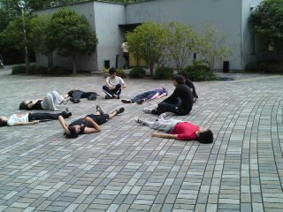
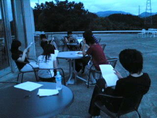
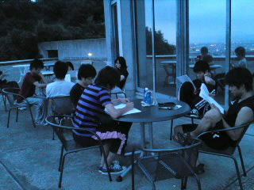

こんばんわ。

一回生のオリオンと申します！！

前回のとちぎ同様に初めてブログを担当させてもらいます。

あまり慣れてないんで変な文章とかになってるかもしれません(´；ω；\`)

暖かい目で見ていただけると助かります・・・

え～今日の稽古はですね

まず

筋トレを致しました。

写真をみていただければわかると思います。

腕立て、腹筋からの手をにぎったり開いたり（っていう名前でいいのかな？）

最後の方は腕が上がんなかったけど達成感がやばかった！

そのあと発声をしました（＾ｖ＾）

高いとこから見下ろしながら発声できるこのキャンパスはすばらしいと思います。

ただ・・・草むらから虫が寄ってこなければ・・・！！！

発声おわってからは読み合わせ。

今日は外でやったのでいつもとは違う雰囲気でした。

ひとつのキャラにあった声を出すのってむずかしいですね。

回数かさねるごとにうまくなるようにがんばります！

じゃあ

明日も頑張っていきましょう！！！
