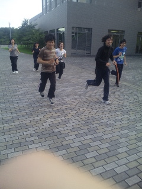
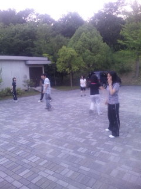
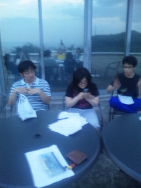

二回のこうへいです。おはようございます

今日の稽古メニューは、走り込み→基礎練→ブレスト→読み合わせって感じでした。

いやー、皆さん発想力すごいですね。ブレスト面白かった！ブレストて、ブレインストーリング？よくわからんけども。

名前鬼はひどかった。今回は母方の苗字でバトル。…名前覚えんの苦手なんですよ。グダったのは許してください…

まぁなんといっても本日メインはラパウザですよ！しゅーぞー！

しゅーぞーしゅーぞーしゅーぞーしゅーぞーしゅーぞー！

しゅーぞーハンパない。しゅーぞー最高！なんか本人しゃべってないのに勝手に話広がって、どや顔でじょいかむさんの腹筋破壊してほんまハンパない！

ん、日付変わってるやん！もう７月ですね。これからも稽古が楽しみだ！期待してるでしゅーぞー！
