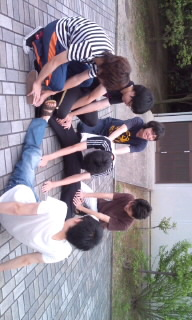

一回生のともかです。

blog書くの初めてなので、何を書いていいのか…

今日の稽古は

走る→マッサージ&ストレッチ→発声→テンション重ね上げ→投げてもいいものに喜怒哀楽→台本読み

という流れでした。

マッサージは相変わらずとちぎの声が…

さらにとちぎが堅いということでみんなで協力しました。

ものに向かって喜怒哀楽。投げてもいいものをって言われて始めはびっくりしましたが、ペットボトルやら割り箸やら消しゴムやら…

皆の様子を見てるのはおもしろかったです。

今日はじょいかむさんと一対一で面談も。

どの役になるかドキドキです！
