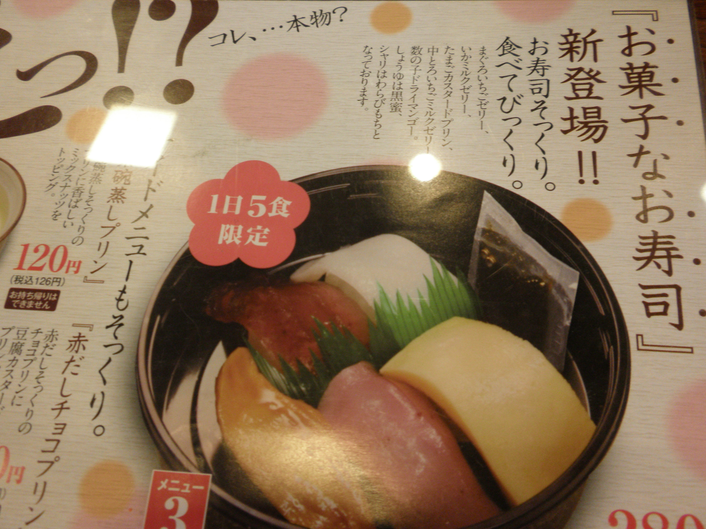
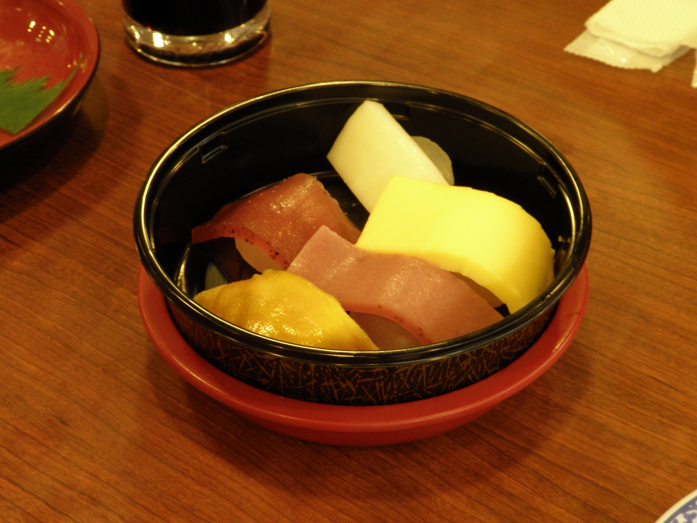

こんにちわ、初投稿な二人ぼっち3回生のライスバーガー（以下ライス）です(　･ω･)ﾉ

まず僕の事を少し書きますと、

・万絵巻では

小道具・舞台監督・役者・他いろいろな感じです。

・見た目

色黒。中肉中背。男。

・趣味

公に書くのは憚られる内容の為割愛Σ(´д｀;)

です。

最近ネギま！に再びハマっています、１～30巻(未完)を2週間で2~3周よんでしまいました・・・・( ´\_ゝ｀)

本日は午後の授業が空いてるのでお昼から小道具(@1個)の材料の買い出し&材料検討とか諸々の為に高槻の町をｳﾛｳﾛしてました。

mixiのボイスで公言したら4回生の箱入り娘、もとい箱詰めなかや(以下なかやん)さんと心兄(以下トニー)さんが買い出しに付き合ってくれるとの事でダイソーと、ちょっと歩いたところ(171号線沿いの高槻のフレッツ)で買うもの買ってお昼からくら寿司で遅めのランチ(＊ﾟ∀ﾟ＊)

ライヌ：握りとうどんセット　おかしなおすし　1皿

なかやん：握りとうどんセット

トニー：なんか3皿！

トニーさんはご飯を食べてきてたそうであんまり食べてなかったです。

おかしなおすし・・1日限定5セットらしい、本当見たいだけで頼んだ、いまは後悔はしていない。。

トニーさんにマグロ（イチゴ）、なかやんさんにタマゴ(プリン)・マグロ（イチゴ）・ウナギ(ドライマンゴー)食べてもらいました。

おいしそうなお寿司ですね、でもお菓子らしいです。僕は真ん中上のイカを食べました、ミルク味でした( ・Д・)

なかやんさんによるとタマゴが一番おいしかったそうです。

飯食って外でたら超雨ふってました、流石梅雨ですね。フレッツがすぐ横にあったので傘を購入して学校に上がりました。

5限に授業補助のアルバイトあると思ったら今日は水曜日なのに木曜日だと勘違いしててひーまな時間が長かったです。

稽古も久々に参加、大きな声出せるようにならないとなーという感じですねー、声量大事です。

そういえば本日は七夕でしたね、願い事を短冊に書いて笹に吊るすなんて誰の発想なんでしょう・・・？万絵巻の七夕は9日なのでお願いしそびれました。でも即物的なお願い事しかないので願うより働けですね、バイトもがんばります。
