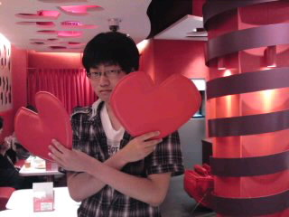
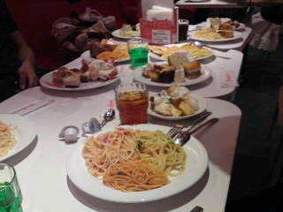
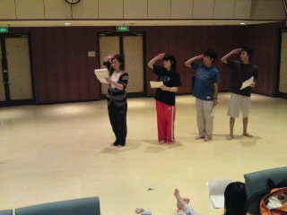
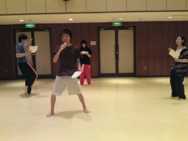

２回生、はみ子席に座ってたイタリアです…

演出さんに言われました…

今日は１回生初めての公民館稽古！ でも、２３人中８人しかいなかった…

全体の４分の１でなく、３分の１ですよ演出さん(笑)

稽古は…人がいなく代役多し！ 人がいないから序盤しかできなかった

稽古終わりに８人－１人でポケモンセンター、スイパラ行ったぜ、ひょほーい！！

ポケセン行ってテンション上がりまくる！！ ドクロッグ、ヒポポタス、パラセクト、デリバードなどなど

一番驚いたのは頭だけのセレビィ…虫みたいやった…

目がいってるヒトカゲがいたりいなかったり…

映画の前売り券なくてこーちゃん残念！ 図鑑完成ならず！

その後、梅田のスイパラケーキがかなりあった!!テンションがまた上がった!!食べるのに夢中で話し全然聞いてませんでした(笑)

皆は早々にギブアップだったけど、私と本日生誕日であるとんなさんは８０分間、常に食べ飲みしてました 勝ち残りました！

途中で演出さんのカバンを隠したryなくなったりしましたが最後はかき氷でしめました

その後、ヒマしていたitoxさんと合流してプリクラを撮ってわたしとＮやんと帰りました

稽古よりポケセン、スイパラの方が記憶に残る日でした

ＴＯ ＢＥ ＣＯＮＴＩＮＵＥＤ
