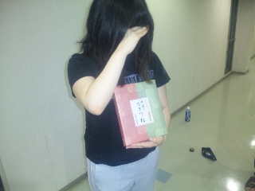
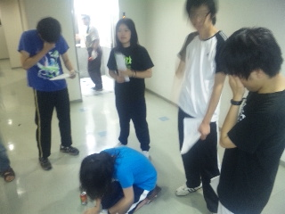

(゜Ｕ゜)ノ

どうも。こうへいでございます。本日のブロゲストは私めがつとめさせて頂きます。ニヒヒ

稽古内容はというと、発声→読み合わせ→立ち稽古という、いつものメニューから基礎練を抜いた感じでした。

みんなもっとハッチャケていこうず！なんて思ったり思わなんだり。テンソン上げんと暑さに負けるよ！夏はアホやらかしてなんぼや！！とゆうのを去年の夏に学んだ気がする！

そして小道具ふえまくりんぐ！(わぁい)

間に合え～

写真は音響チーフさんを弔う様子^^そして新たなチーフ、「生八ッ橋」。この後スタッフがおいしくいただきました。

ついでに伝説の『ＭＩＳＨＩＭＡさん』を捉えた貴重な写真。

梅雨明けはもうすぐ！きばっていこー
