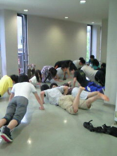

こんばんは、4回生のしぃです

今日も雨ですね

早くこのじめじめから解放されたいものです

さて今日の稽古は筋トレ→発声→基礎練→台本稽古でしたよ！

基礎練まではモルツチームと合同でした(。・ω・。)

雨だったため生協横のせっまい空間にて約14人でドSな演出指導のもと筋肉を痛め付け…

基礎練では何故かチームで張り合ったりなど、和気あいあいとしておりました(・∀・)ﾉ

他チームと絡めて楽しかった！

そしてそして、メインの台本稽古では「ぜろば」から順に通して行きましたよ！

まだまだセリフが頭に入っていないせいか動きがぎこちないですが、これからどんどん伸びていくんだろうな…と楽しみに思います☆

私も頑張らねば(\*´∀｀\*)

夏はこれからっ！！
