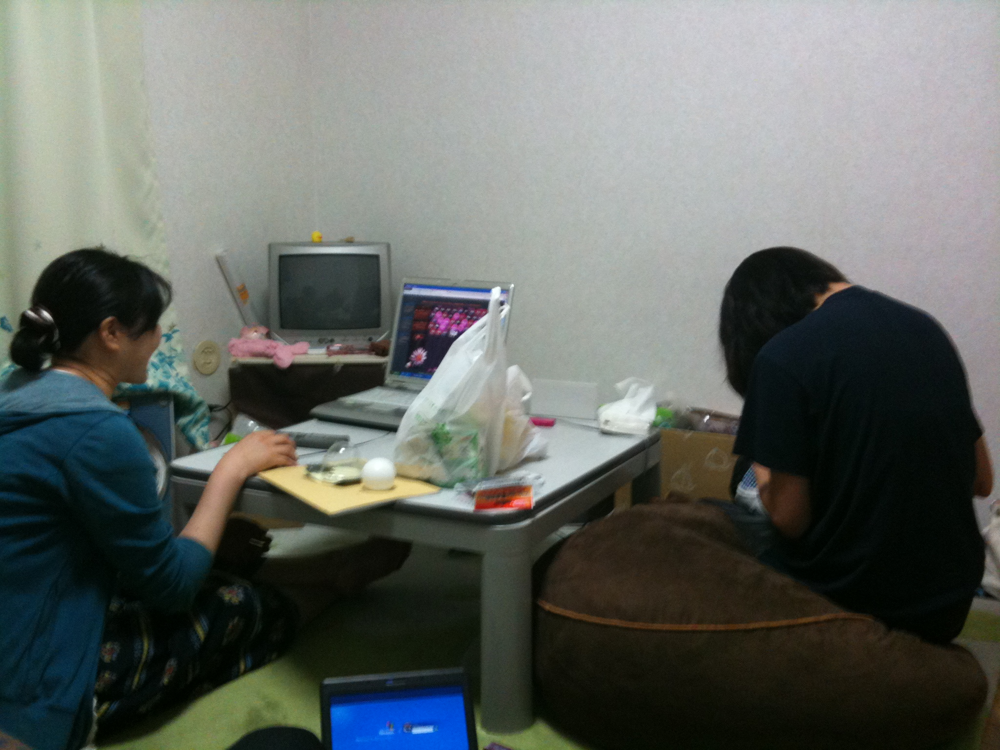

テスト習慣★━━━…・‥ キ(･∀･)タ・‥…━━━☆

＿|￣|○←※ライスです

本日はテスト０教科だったんですがなんと9時に学校に上がりC棟でいろいろ仕事を片付けた後にS棟で飯を食い、単位習得のために暗躍し、20時近くまで万絵巻の本拠地S棟にて勉強しましたでございます（CAD/CAMシステム&ヒューマンインターフェース）

ただしずっと勉強していたわけではなく、16時くらいから公演用のパネルの新聞張りを僕・おへそだいじです（以下すみぃさん）・他チームの座長を筆頭に最終的には４～５人ほどその後に加わって作業を1時間～ほどしました。

20時くらいに学校から下山、飯（定番のくら寿司）、そして現在すみぃさん宅にて勉・・・

勉強してます･･･よ？

いや、いまからやるんです、明日の13時くらいのテスト開始まで勉強する（予定）なので、イキヌキイキヌキ。

写真はパソコンでモサモサな暇つぶしゲーをしているすみぃさんと編み物中のしぃちゃんさんです。

いまから勉強頑張ります　

ｂｙライス
