今日でテスト終了！

打ち入り行ってくるぞー！！！

いえいえ、

そのまえにとんなさんの地獄の基礎トレーニングがあるそうですよ＾＾

## 本日の名言1

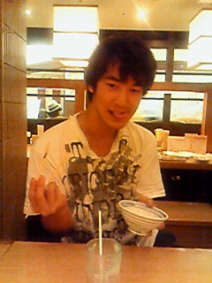

食べられたい奴はおれんとここい！

## 本日の名言2

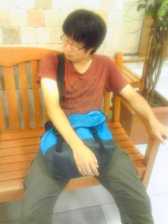

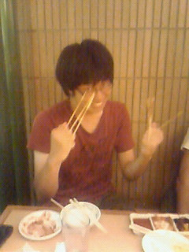

揚げられたい奴はおれんとこにこい！

## 予定より早く死ぬ

こんばんわ、しぃです

やっとテストが終わり、いよいよ明日からは本格的に夏公稽古が始まります

さてさて今日は書く事が盛り沢山

大きく分けて以下の3部構成でお送りします

1回生紹介

とんな氏の基礎力アップ講習会

うち入り

まず1つめから～

今回は【パトラ】を紹介します

あだ名：パトラ、みずき

本名：松岡瑞紀

役職：役者、音響、大道具

あだ名がとっても高貴なのは、2回生ふぁらおの隣にたまたま居たからだそうです!笑

もし違う人の隣に居たらどんなあだ名になっていたのか気になる所ですね

さて、そんな彼女は今回初役者として日々稽古を頑張ってくれてます

台本覚えも早く、ノリとテンションも素晴らしいです！

ちなみに劇中では彼女と相方ですので絡みに絡んでいきたいなと画策中だったりします

ぁそういえば、役者だけでなくて裏方全般をマスターしていきたい…と言っていたので、スタッフ面でも期待大です

特徴：吹奏楽、美脚、男前な美声、ミニーちゃん

以上！

何か追加・間違いなどあったらコメントにてお願いします

次は、とんな氏による基礎力アップ講習会

テスト終了後、久々に稽古をしました

メニューはというと…

柔軟→ミザンス→ファミリーポートレート→キャラエチュード→橋エチュード

とにかく基礎練を沢山しました

テストで鈍った身体に鞭打ちながらでしたが、久しぶりの稽古は楽しかったです！

沢山のダメ出しを消化して今後活かせるようにしていきましょう(。・ω・。)

トニー指導ありがとう☆

稽古で沢山動いた後は、串家でうち入りです

みんなガッツリ串カツやらを食し、楽しそうでした

中でもしゅーぞー、ふぁらおがヤバすぎでした

前2件の記事ですでに挙がっていますが、彼らの決め台詞(？)が生み出されました(笑

他にも油まみれのブツを食べたしゅーぞーの名言(タイトル参照)やしゅーぞーの嫁がコーンだったり嫁をふぁらおが食べたり、芸術的なソフトクリーム、リア充を見つめる瞳などなど本当に愉快でした(\*´艸｀)

何だか書き出したらえらいことになるので、そこそこにしておきますね

後は画像で楽しんでください！

それでは長々と失礼しました(’∪’\*)

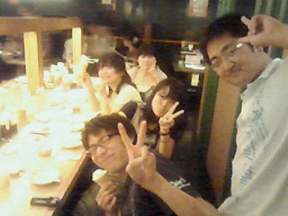

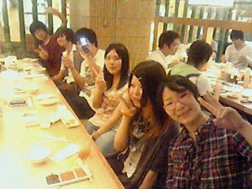

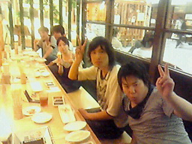

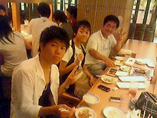

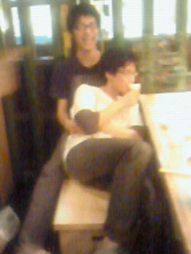

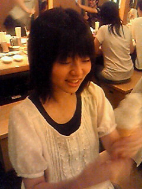

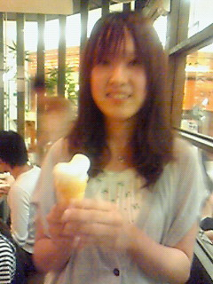

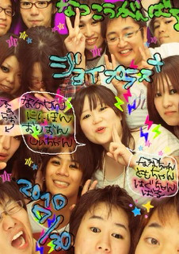
