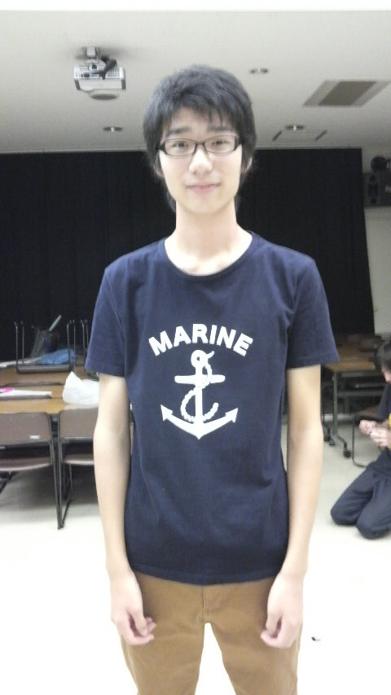

４回生のトニーです。

今日も１回生の紹介いってみましょう！！

本日紹介するのは渡辺祐司くん

↓プロフィール

あだな：とちぎ、とち子

本名：渡辺 祐司

役職：役者、音響

特徴：高身長、ラーメンズ好き、めっちゃくすぐったがり、高校時代は吹奏楽部

特徴にありますが、極度のくすぐったがりで柔軟の前のマッサージがまともにできません(笑)

そんなとちぎですが、稽古場では役に向かって真剣に取り組むめっちゃいい子です。今回は、お芝居上とても重要な役を演じています。ネタバレになるので書けませんが、本番はとちぎに注目です！！ってか注目せざるを得なくなりますよ(笑)

乞うご期待☆

あ、何か足りないこととか、とちぎの武勇伝知ってる人はコメントお願いします！！
