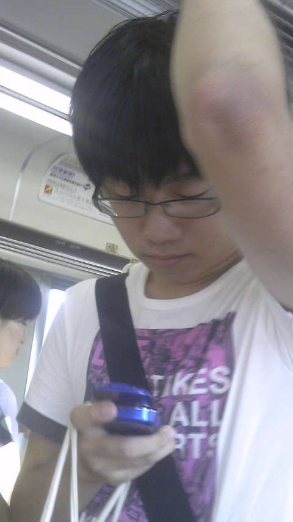
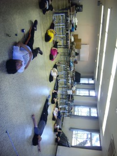

今日の稽古は朝９時～12時半真上公民館でした。

朝早かったのでみんな眠そうでした(ρд-)zZZ

公民館では基礎練と台本稽古をしました。

公民館稽古が終わった後はマクドでお昼ご飯。

そのあとはスタ会＆話し合いをしました。

皆セリフの解釈が違っていたりして、台本を読み込むことって難しいけど大切だなと思わされました!!

話し合いが終わってからは公園稽古しました。

明日は初の通し!

がんばるぞ～!!!

写真は発声の様子としゅーぞうプライベートverです。

以上、２回生はぐでした。
