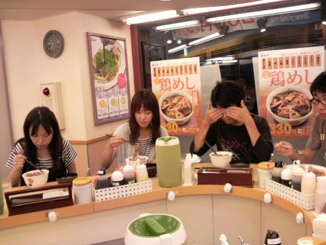
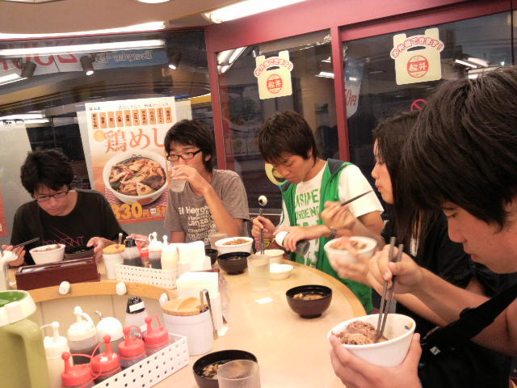

皆さんこんにちは、４回生の心兄ことトニーです

いよいよ本番まで１０日をきりました。メンバー一同本番に向けて日々奮闘です。

さてさて、今日の午前中は役者皆で台本の全てのシーンの意思統一をしました。今更な感じもしますが、残りの稽古時間を有意義にするため、また本番により良い作品にするために、再確認をした感じです。全部のシーンをしたので、結構時間がかかりました

その後の昼休憩では演出さんの計らいで水浴びをしました。皆童心にかえってはっちゃけてましたね(笑)

ただ稽古着のままでやったので、ずぶ濡れ。

まぁサンサンと照りつける太陽の下、すぐ乾きましたけどね

休憩後は台本稽古。自身も皆もなかなか思い通りのシーン展開ができず不安を感じていたのですが、少しずつ良い感じにシーンが詰まってきて光が見えはじめました

そして明日は３回目の通し稽古。思う存分稽古の成果を発揮したいです

追伸

写真は稽古後に数人で松屋に行ったの巻です!
