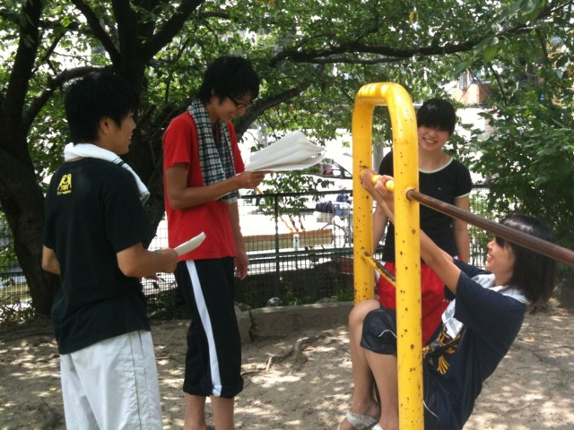
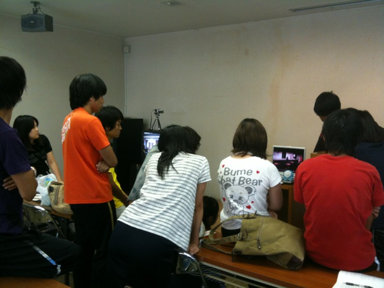
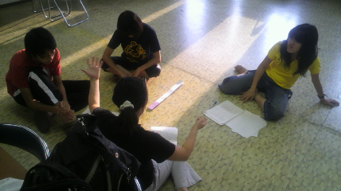
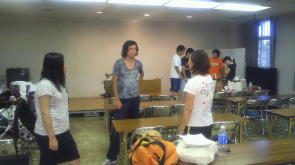
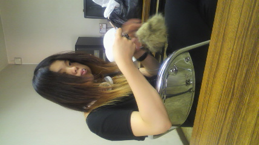
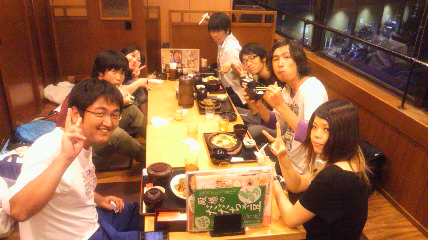
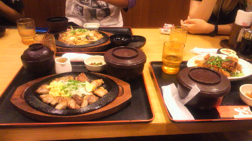

「このチーム、みんな仲良いですよね？(笑」

昨日、とちぎが言ってた言葉です。

1回生から4回生まで、仲が良いこと。稽古場に、高めあう良い雰囲気が出来ています。

by itox

## 過去を振り返ること

何事も、過去を振り返って参考にすることは大事ですね。

今日は、過去の卒業公演の「爆裂ガール」を鑑賞中。2年前で、演出がまだ2回生だった頃です。今でも思い出のシーンで、後輩達と笑ってしまいます。(笑

時が経つのは早いですね。「この頃同い歳だった先輩みたいに、ちゃんと振舞えてるかな？」と、いろいろ自問して考えてしまいますね。

俺も頑張るぞ！

by itox

## 延長戦継続中

優しさに触れながら引き続き真上公民館

1、熱弁する演出

2、キャラ作りちう

3、麗しの衣装チーフ

## ばーんごはーん

とんな、とちこ、おかざ、ゆずぽん、いとっくす、すみの、しゅーぞー、演出@天狗

疲れたあとはご飯に限る

疲れすぎてたり忙しすぎてたりでかえっちゃった人もいて残念です

(´・ω・\`)/~~

疲れたぁぁぁぁぁぁあ

明日は4回目の通しぃぃぃぃぃぃぃ

