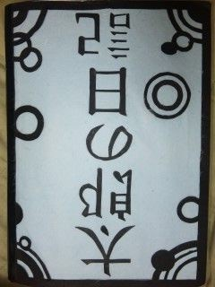

2010年度万絵巻自主研究発表公演チームジョイプラス＋「ほんと」にご来場頂き、誠にありがとうございました。

さて、此度は開演時間をこちらの都合で遅らせ、またそのお知らせをするのが遅れて申し訳ありませんでした。今後はこのような事態が二度と起こらないように劇団員一同邁進していく所存です。どうか今後とも変わらぬ ご指導・ご鞭撻のほどよろしくお願い申し上げます。

色々書きたいことはあったのですが、うまくまとまりませんね。

公演後、お客様から嬉しい言葉をたくさん頂いて本当にびっくりして色々パンクしてしまいました。お見苦しい姿で申し訳なかったです。この夏の経験を私含め、メンバー達が今後活かしていってくれればと願うばかりです。

私はこの夏、このメンバーで公演をうてた事を幸せに思います。

それでは最後に　シ　エ　ス　タ　！

チーム　ジョイプラス＋　演出
