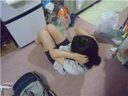

一回のリバーです。

とりあえず自分の自己紹介から入りましょう。

本名は岸本拓也。京都府出身のうお座。とりあえず今はとある魔法使いの映画が見たいです。

そして昨日というよりも８月１日の稽古は全員で夏公の台本を読み合わせした後エチュードをして解散って感じでした。

これから暑い夏を頑張って乗り切りましょう。

## 面白い内容

テストが無事終わったので参加することがようやく出来たよしおです！！

初めは普段と何も変わらない練習から始まりましたが、僕は全然いけていなかったのでかなり忘れていることが多くやらかした感がはんぱなかったです(-\_-;)

皆さん迷惑をかけて申し訳なかったですm(\_\_)m

そして台本の読み合わせに入り初めてだったのですごく雰囲気に圧倒されました〓

僕も２回ほど読ませて頂いてすごく楽しかったです！！台本を読んでいて凄く面白かったし先輩方も優しくてこのチームで良かったと本当に思いました

10日からは全部参加出来るよう頑張るのでこんな僕ですがよろしくお願いしますm(\_ \_)m

以上面白みが全くない内容のよしおでした笑

## 夏休み突入！

初ブログになります、一回生のふろむです^o^

ジュークに引き続きはりきって腹筋しますよ！

テストから解放されて

稽古が楽しくて仕方が無いですね！

さらにキャストも発表されまして、ますます力がはいります。

今日の稽古は、公民館を使ってのはじめて動きをつけながら稽古しました。

実際に動いてみると面白いのなんの！

稽古やるごとに台本好きになっていきますね。

あと先輩たちの稽古姿はとても勉強になります。やっぱりすごいなぁ。

私も精一杯頑張るぞ！(｀・ω・)=3

公演時には新しいふろむをお披露目できるといいですね！

どうぞよろしくおねがいします！！
