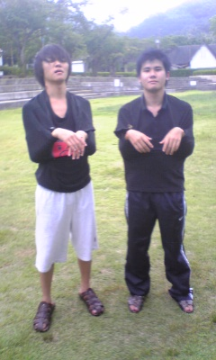
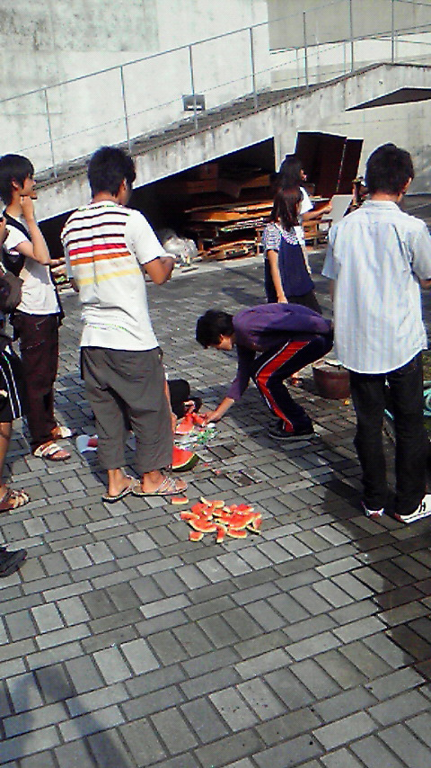

今日のブログ担当はアラキです。

学校で稽古だったけど停電で自販機が使えなくてマジキチだったので摂津侠まで移動して稽古しました。

割と涼しくて学校よりましだったかな？

途中で雨が降ってきて湿気で暑くなったりして大変やった。

最近うちのチームはよく雨にあう気がするなぁ。

写真は雨が降ってこーへいとエビスがジャミラもどきになった姿です。 今日のバイト辛いわぁ～

## suika

暑いですね！暑さの余りに絶えず皮膚が溶け、液化しているような気さえします。

ま、ただの汗なんですが！

そうそう、三回生になったパッサです。

皆さんはどうですか？

元気ですか？

私はクーラーの効いている場所に居るときだけ、元気です。地球温暖化反対！

そんなことはどうでも良いですね。

稽古の話を書きます。

昨日はびっくり色々あったんですよ！

荒通しをして、スイカを食べ、タクトさんと猫さんがいらっしゃいました(50音順)。

これを時系列順にすると、

猫さんとタクトさんがいらっしゃり、

スイカを食べ、

荒通しをした。

に変化します。

ちょうど、上と下では順序が逆ですね。運命を感じます。

そろそろ文章だけもきつくなったので、画像をば。

写真はスイカに群がる人です。このスイカは演出・梓の差し入れで、

３Ｌはあろうかというとても大きなスイカでした。

クチャクチャになった残骸からも、かつての壮大さが伺えます。

とてもうまかっです。

あま うまみたいな。 閑話休題。

運命といえば、KNIFEですよ！

KNIFEといえば荒通しですね！

荒通しはとても荒々しかったです。

それぞれに大きな課題を残していきました。

私の課題は、今更語るまでも無いですが、滑舌ですね。

滑舌の悪さが目立っていますが、

他にも課題がボロンボロン見え隠れしています。

本番までには確実に治す！多分治すと思う。

治せるんじゃないかな……。

ま、ちょっと覚悟はしておいてください。
