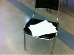

おーすみです。

きほです。

コハルちゃんの紹介通り

はぐさんより小さい一回生とは

私のことです！(どやあっ)

今のところ147センチですが…

第三成長期に期待！＼(^o^)／

あと雑キャラらしいです

ピアニカさんの弟って言われます

正直心外です！笑

と、自己紹介はこれくらいにして

今日は午前中大道具の作業をしてました

ノコギリぎっこぎっこして

ペンキでぬりぬりしましたよ！

暑かったです( ；´Д｀)

で、昼休憩なうです

午後からはサーキットからの

台本稽古…かな？

ということで写真は

遠目から見た台本です

スタジオナガタは演出さんの

オリジナル台本です(^O^)

中身が気になりますよね？ね？

ちらっと教えちゃいましょうか？

なーんちゃって

教えませんよー

写真見て でも読めなくて

ああ気になるなあ…

って思ってくださいd(￣ ￣)

今日寝るまでにやってくださいね！

絶対ですよ！！

一回生からのお願いでした。

あと2分で休憩終了！

帰省するメンバーは

もう帰ってしまったので

今現在S棟にいるのは7人！

す、少ない！

それでもスタジオナガタ

いつもと変わらず稽古に励みますよ！

次は誰を紹介しようか…

目の前にいるひじきに

バトンタッチします(^O^)／

新発演出頑張って！

では18時まで？稽古してきます！

