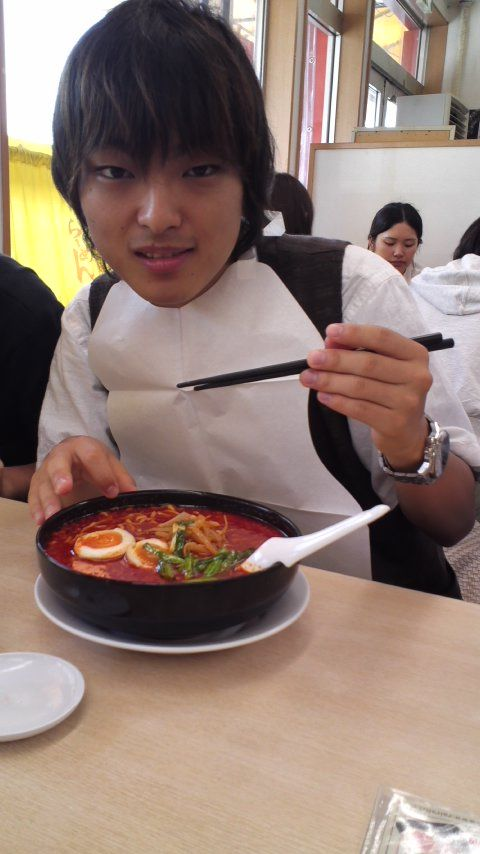

どうも！万絵巻の全自動おしゃべりマシーンことぴあにかです！

ただいまキャンプの準備をしながらブログを書いておる次第でございます。

あっ、今日はitoxさんが稽古にきてくださったのですがゴミくんが書いたので割愛します。

んでなんの記事を書こうかと考えた結果、戦国時代の話でかの有名な今川五郎義元について書こうかなと。

戦国無双や戦国バサラなどて顔を真っ白に塗られて散々な扱いを受けている義元ですが、本当は織田信長を優に超える求心力を持ち、同時代の誰よりも先進的でカリスマを備えた大名なのです。

今川仮名目録追加、寄親寄子制度、流通統制、まだまだ義元が考えた革新的な制度はありますが、一つ一つ説明しては時間が足りません。

ではその中でもっとも分かりやすい、「今川仮名目録追加二十一条」についてお教えしましょう。

この内容は父、氏親の今川仮名目録とは根本的に目的を異にします。それは「民の紛争解決」ではなく「民を支配する」法であり、同様に行われた義元の「検地」も「裁判資料・配分」のために行われたのではなく「搾取」のために独自に行われたのです。これは朝廷や幕府からの大義名分を必要としない今川家独自の強行支配に乗り出したということになります。

まとめると「今川仮名目録追加」とは上は幕府の権威下は農民からの圧力、そのどちらでもなく義元自身の力で法を掲げ民を収めるという【独立宣言】に他ならないのであります。

この前代未聞の自負の表明によって様々な意味での新たな戦国大名が誕生したのです。

おっと、続きを話そうかと思ったのですが少々疲れたので私はキャンプの用意をしに戻ります。

続きはまたいつの日か…

## うっす！！ぴあにかっす！！

つーじーです。

今日からキャンプっすわ！！

今から準備っすわ！！

集合10時っすわ！！

すわ？！

頑張ります

すわっっ！！！！

つーじーでした

でゅわっ！！

## 来来亭にて

たろうです。

キャンプ一日目のお昼は来来亭でした！

そこでの一枚なんですが

たかしさんが旨辛麺を注文したんですよ

そしたら紙のなんかよだれかけみたいなやつが出てきたんですww

もうこれは撮るしかないと思いカシャッといきました

たかしさん素敵ですわ(´∀\`)

