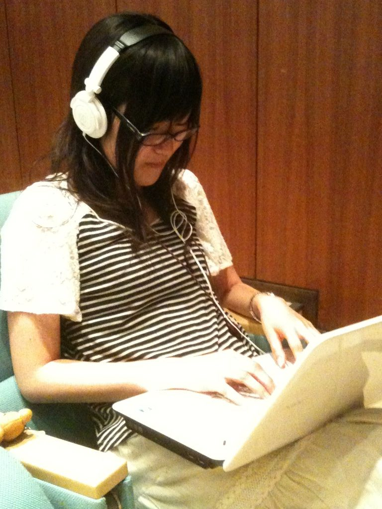

皆さんこんばんわ、クックです。初ブログです。初。緊張、は特にしません。ウヒョーッ

今日はですね、一回生紹介をしていきたいと思います。一回生と言えば夏公の華ですからね、そりゃもう盛大に紹介って行こうと思いやす。パーリナイな感じで。という訳で、本日紹介させて頂くのはこちら！

橘酒造の音の要！現場系仕事人女子！！モッティーさん、もっちーさんに次ぐ「も」の字、その名も、「もっち」です！！！

写真は今日の稽古場にて。この職人姿、アンジェラアキを彷彿とさせますね。うん、黒髪メガネってくらいしかアキ知らないけど。

今回もっちは、当チームの音響チーフをしてくれてます。日々音集めに奔走したりiPodが壊れたりしながらも、頻繁に稽古場に顔を出してくれる様に四回生はこっそり感動とか喜びを感じてたり。現場系女子テラモエス

スタッフさんが稽古場にいる頼もしさを改めて実感させてくれます。

他にも一日にボーダー、水玉、チェックのどれかを必ず服装にチョイスしたり、mixiで一週間全コメント週間とかしてみたり、キャンプ地でセミの鳴き声を録音したがったりと中々個性的な娘ですが、とにかく面白い、良い子ですお。本番中に後ろを見ると、必死に音響卓で頑張るもっちが見れるかもしれないです。

夏公本番、我ら役者勢と共に、ひそかに後方の彼女も見守ってあげて下さいな。なにか心打たれる物が、あるかもっすよ。ガタイ系四回生でした。
