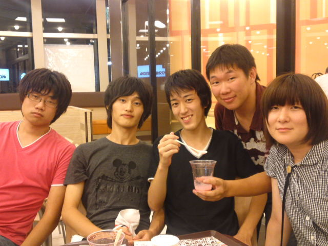

　

はじめまして、噂の１回生、もっちです。

ネイティブな発音をせず、最後に伸ばし棒『ー』もない、ただのしがない“もっち”です。名前だけでも覚えて帰って下さーい。

今日のブログ担当をさせて頂くことになりました！恐縮です！ちゃんと投稿できてるかな？

夏公では音響・小道具を担当しています。恥ずかしながら音響チーフやらせてもらってます。

写真はついさっき撮影したものです。

左から演出のしゅーぞうさん。ピンクがお似合いの素敵な先輩です。音響のお仕事がサクサク進むのは演出さんのおかげです。

次に一回生のたろう。おしゃれで、なかなかナウいです。結構ナウいです。ステキイケメンです。

次にゴミさん。面白くて素敵な先輩です。ゴミさんの一発芸には抱腹絶倒です。笑いすぎて腹筋割れました。

そしてぴあにかさん。雲の上の存在です。ぴあにかさんとのお話は楽しくて仕方ないです。なかなか恐れ多いですが、チャンスがあればたくさんお話したいです。

そして最後、一番右は私です。嘘です。スタジオナガタ様からゲスト出演の一回生のくみちょーです。くみちょーはなんかもうすごいです。くみちょーとチーム離れて悲しいMAXです。

↑↑↑

以上私の印象でした。脚色一切なしです。

私の印象は、２こ前のブログの、素敵な先輩、クックさんによる紹介を見ていただければ掴めると思います。でも、いいところ(？)しか書かれていないので恥ずかしいです。私は普通の一般ピープルです。

万絵巻は優しくて楽しくて演劇にアツい、素敵な先輩・同回生ばかりです。毎日が楽しいです。

なかなかこういうことを口にできるタイミングがないので、この場を借りて打ち明けました。　

近況報告をすれば、今日はＳ棟にて３チームのゲネがありました。個人的感触としては、音響オペ失敗しまくってやばかったです。あと約１週間、頑張ります。演出さん、役者さん、他スタッフさんの努力を無にできないですもんね！

気がつけば本番まであと１週間くらいしかないんですよね！不安とわくわくが交差してます。夏公演は、他チームに会えないのが寂しいですが、終わってしまうのもすごく寂しいです。

終わってから、楽しかったね！って言えるような夏にしたいです。頑張ります◎宜しくお願いします！

長々失礼しました。最近すぐ眠くなる、もっちでした。よし！
