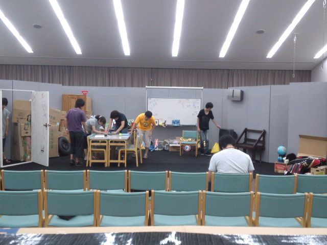

　

お疲れ様です！一回生のもっちです。

今日は小屋入り１日目でございました。うちのチームは場当たりでございました。

音響からの風景です、クリア！

今日は雨が降ってて大変でしたね(@\_@)みなさんが風邪をひかないよう願ってます(@\_@)

――――――――――――――

というのを昨日送信するの忘れてました。9月2日のもっちです。

今日は２日目、今日も頑張ります！

## 第15回自主研究発表公演中止のお知らせ

台風に伴う関西大学劇団万絵巻2011年度第15回自主研究発表公演中止のお知らせ

このたび発令された暴風警報を受けて、先日お知らせ致しましたとおりに、第15回自主研究発表公演を中止とさせて頂きます。

心待ちにされていた方々には申し訳ございませんが、当日宿泊者以外の方の高岳館の立入は学校側からの通達で全面禁止となりましたので、ご了承下さいますようお願い致します。

この件に関しまして何かご不明な点などございましたら下記の連絡先までお問い合わせ下さい。

関西大学 劇団万絵巻 福重

TEL:090-6988-5416

E-MAIL:luckystar-and-crescentmoon@docomo.ne.jp
