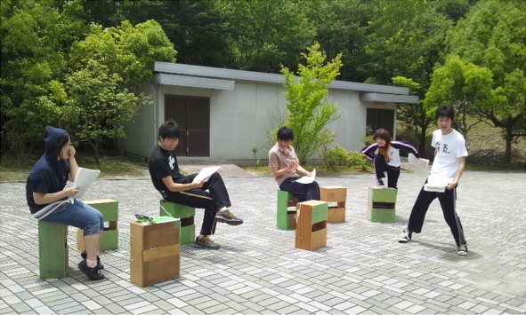

どうも今夏初ブログです。広報兼役者の就活怠る系四回生、にいもとです。

今年の夏チームは皆ブログをちゃんと更新してくれるので嬉しいです。

今日はキャスト決まって初めての稽古でした。

いきなり立ち稽古でした。演出の無茶振りが怖いチームです。

稽古はなんだかなんとなくそんな感じで進んでいってなんとなくそんな感じで終了しました。楽しかったです。

なんとなくそんな感じな台本なのでそんな感じがちょうどいいのかもしれません。

ただ、学校での稽古だったので、ビックリするほど焼けました。日焼け止めを塗っていたにも関わらず、綺麗な七分袖焼けができました。

これ非常に痛いです。真っ赤です。泣きそうです。皆で日焼けの薬塗りたくりましょう。

まだ夏も始まったばかりなのでこれからガンガン焼けていくのかと思うと日焼け跡が疼いてきます。

屋外稽古の際は、例え暑くとも長袖と帽子、もしくは日傘の使用をおすすめします。

しかし痛い。ヒリヒリする。
