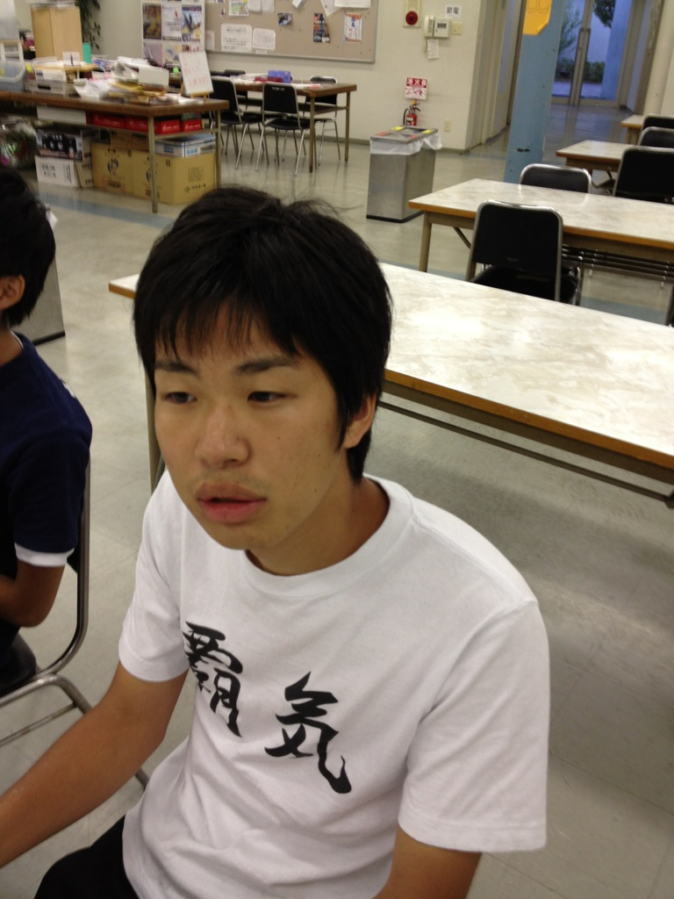

どうも、ガリオチーム3回生のしゅーぞうです！！

先週の土曜日まで外部公演に出ていてあまり稽古に来れてなかったですが、ついに夏公稽古本格参加しました！！

いやー、稽古楽しいです！！

なんやかんやで楽しいです！！

一旦話し変えて落ち着いて考えても楽しい！！

やっぱり夏はこうでないとと思いつつ、はやく走りたいなと思いつつ稽古楽しんでます！！

本当にこのチームで良い作品が出来るように頑張ります！！

今日は基礎練でエチュードしたぜぇ～。もっとしたかったぜぇ～。

台本稽古は読み合わせをして、会話の雰囲気を再確認出来たぜぇ～。早く憶えて詰めていきたいぜぇ～。

急にすみませんでした。テンション上がってしまいました…。

とにかく、これから本番まで楽しくワイワイしながらけいしていきます！！よろしくお願いします！！！！

iPhoneから送信

